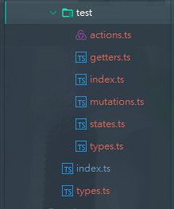

[vue.config.js配置解析](https://cli.vuejs.org/zh/config/#publicpath)


# TypeScript在vue项目中的使用

> 在vue中使用Typescript并不一定需要做以下修改，可以在ts代码块中继续写js代码，因为ts本来就是js的超集，自然能使用作为子集的js，但typescript可以解决js定义变量不确定类型的弊端，能在编写代码时就发现代码的bug

## 修改vue中的script标签

在vue中使用TypeScript只需要修改script标签，加上lang = ‘ts’就可以使用typescript来编写Vue，别的模块照常写

vue提供了vue-class-component这个包来方便我们改造vue的结构

vue官方推荐使用：vue-property-decorator来进行操作，该包为上述包的扩展，不仅包含了上述包，还包含了别的语法，[学习链接](https://www.jianshu.com/p/d8ed3aa76e9b)

原本js代码块抛出的是一个自定义的对象，现在我们需要在ts代码块中抛出的是一个Vue为我们定义好的Vue对象的字类，我们需要在这个抛出块上加上@Component注解


现在只需要在类中直接定义属性和方法即可

注意：

当属性值为undefined时数据可能不会被绑定到html中，这个时候我们还是需要用到原本的data钩子函数来声明属性

```javascript
<script lang = 'ts'>
import Vue from 'vue'
import Component from 'vue-class-component'
@Component
export default class Counter extends Vue {
  // Class properties will be component data
  count = 0
  // Methods will be component methods
  increment() {
    this.count++
  }
  decrement() {
    this.count--
  }
}
</script>
```

computed:现在需要在类中声明计算属性的set方法和get方法

```typescript
firstName = 'wang';
laseName = 'yi';
get fullName(){
	return this.firstName + ' ' + this.laseName;
}
set fullName(value) {
    const split = value.split(' ');
    this.firstName = split[0];
    this.laseName = split[1];
}
```

生命周期的钩子函数：照常使用

注册子组件：在@Component注解中传入注册配置对象，并在属性中配置

不仅包括子组件，还有以前的别的属性比如watch，props

```typescript
@Component({
  // Specify `components` option.
  // See Vue.js docs for all available options:
  // https://vuejs.org/v2/api/#Options-Data
  components: {
    OtherComponent
  }
})
```

定制钩子函数：创建一个新的文件定义要创建的钩子，Vue会为这些方法实现原型，然后在根组件文件中导入

```typescript
import Component from 'vue-class-component'
// Register the router hooks with their names
Component.registerHooks([
  'beforeRouteEnter',
  'beforeRouteLeave',
  'beforeRouteUpdate'
]
```

自定义方法装饰器：[注解](https://class-component.vuejs.org/guide/custom-decorators.html)

组件继承：在每个script代码块中抛出对象时指定名称，可以通过继承机制来继承该组件并在该组件基础上进行扩展


组件混用：类似多继承： extends ==mixins==(Hello, World)  mixins()方法  

## 修改vuex：导入vuex-class方便使用

演示目录结构 

 

### stroe根文件夹： 

- #### types.ts：为根节点指定类型 

```javascript
export interface RootState {
  version: string;
}
```

- #### index.ts:store的根文件

```javascript
import Vue from 'vue';    
import Vuex, { StoreOptions } from 'vuex'; //导入StoreOptions这个模块，该模块为store
import { RootState } from './types';
import { profile } from '@/store/test/index'; //模块名称
Vue.use(Vuex);
const store: StoreOptions<RootState> = {
  state: {
    version: '1.0.2' // a simple property
  },
  modules: {
    profile, //模块名称
  }
};
export default new Vuex.Store<RootState>(store);
```

### 子模块文件夹 

- #### test/types.ts子模块的数据类型

```javascript
export interface User {
  firstName: string;
  lastName: string;
  email: string;
  phone?: string;
}
export interface ProfileState {
  user?: User;
  error: boolean;
}
```

- #### test/index.ts 

```javascript
import { Module } from 'vuex'; //vuex对模块的定义<子节点的类型，根节点的类型>
import { getters } from './getters';
import { actions } from './actions';
import { mutations } from './mutations';
import { ProfileState } from './types';
import { RootState } from '../types';
import {state} from "@/store/test/states";
const namespaced = true;
export const profile: Module<ProfileState, RootState> = {  //在这里指定模块名称
  namespaced,
  state,
  getters,
  actions,
  mutations
};
```

- #### test/state.ts  

```javascript
import {ProfileState} from "@/store/test/types";
export const state: ProfileState = {
  user: undefined,
  error: false
};
```

- #### test/getters.ts 

```javascript
// profile/getters.ts
import { GetterTree } from 'vuex'; //vuex中getter的类型
import { ProfileState } from './types';
import { RootState } from '@/store/types';
export const getters: GetterTree<ProfileState, RootState> = {
  fullName (state): string {
    const { user } = state;
    const firstName = (user && user.firstName) || '';
    const lastName = (user && user.lastName) || '';
    return `${firstName} ${lastName}`;
  }
};
```


- #### test/mutations.ts: 

```javascript
// profile/mutations.ts
import { MutationTree } from 'vuex'; //vuex中mutation的类型
import { ProfileState, User } from './types';
export const mutations: MutationTree<ProfileState> = {
  profileLoaded (state, payload: User) {
    state.error = false;
    state.user = payload;
  },
  profileError (state) {
    state.error = true;
    state.user = undefined;
  }
};
```

- test/action.ts 

```javascript
// profile/actions.ts
import { ActionTree } from 'vuex';   //vuex中action的类型
import { ProfileState, User } from './types';
import { RootState } from '@/store/types';
export const actions: ActionTree<ProfileState, RootState> = {
  fetchData({commit}): any {
    commit('profileLoaded', {
      firstName: 'wang',
      lastName: 'yi',
      email: '2928464591@qq.com',
      phone: '13427479705'
    });
  }
};
```

在vue文件中的调用

安装vuex-class这个包，这个包提供了一些注解来让我们把vuex中的属性和方法绑定到vue组件中便于我们调用

```javascript
import {
  State,
  Getter,
  Action, //常用的
  Mutation,
  namespace
} from 'vuex-class'
// 这几个是提供用于注入的注解
然后在相应的属性或者方法上注解上就可以跟typescript一样使用了
const namespace = 'test';
@State(namespace)
userdata!: ProfileState;
@Action('fetchData', { namespace }) //方法名
fun1: any;
@Getter('fullName', { namespace })
full: string | undefined;

```

