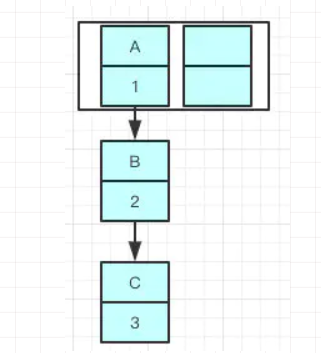

# Lock

> 和synchronized区别？

1. Lock是一个接口，而synchronized是Java中的关键字，synchronized是内置的语言实现；
2. synchronized在发生异常时，会自动释放线程占有的锁，因此不会导致死锁现象发生；而Lock在发生异常时，如果没有主动通过unLock()去释放锁，则很可能造成死锁现象，因此使用Lock时需要在finally块中释放锁；
3. Lock可以让等待锁的线程响应中断，而synchronized却不行，使用synchronized时，等待的线程会一直等待下去，不能够响应中断；
4. 通过Lock可以知道有没有成功获取锁，而synchronized却无法办到。
5. Lock可以提高多个线程进行读操作的效率。（可以通过readwritelock实现读写分离）
6. 性能上来说，在资源竞争不激烈的情形下，Lock性能稍微比synchronized差点（编译程序通常会尽可能的进行优化synchronized）。但是当同步非常激烈的时候，synchronized的性能一下子能下降好几十倍。而ReentrantLock确还能维持常态。

 

 

 

 

# HashMap

## HashMap数据结构

由数组和链表组成，数组中存放着key-value的数据对，在插入时会根据key的hash值去进行计算index值，1.8后链表长度>8会转成红黑树

## 为啥使用链表

在插入时经过多次hash还是可能会把key的值hash到一个index上，这时候就使用链表

每个节点都保存了自身的hash，key，value

## 数组扩容机制

- Capacity：HashMap数组当前长度
- LoadFactor：负载因子，默认值0.75f，当数组容量达到这个阈值时就会扩容
- 最大容量：1<<30
- 如果不指定的初始容量：1<<4 (16)
- 每次扩容2倍<1

例子：假如当前容量大小为100，如果前面75个都均匀散列到数组中，当你插入第76个时就会判断需要扩容

步骤

1. 创建一个新数组，长度是原来的两倍
2. ReHash：遍历源数组重新hash到新数组中

> ### 为啥重新hash而不是直接复制过去？

当长度扩大后hash的规则也要随之改变，这时候hash出来的index位置就不一定相同了

Hash的公式---> index = HashCode（Key） & （Length - 1） 

> ### 为啥使用2的幂来作为HashMap容量？

当使用2的幂时n-1的二进制位全为1，这样的话index的结果就等于HashCode的后几位，只要输入的HashCode本身是均匀的，那么hash算法就是均匀的

## 如何插入链表

java8之前是头插法，新来的值会取代原有的值，原有的值就顺推到链表中

java8后改成尾插法

原因：数组多次扩容后到达一定的数量就会resize，多线程下resize时可能会出现循环链表

例子：给一个容量为2的容器插入A，B，C

当头插法调整完成后可能出现B指向A的情况，而此时A的next仍然为B，就出现了循环链表

而使用尾插法的话就会保持原来的顺序

插入过程：

1. 先计算要插入的值的对应的hash位置
   1. 如果为空则直接插入
   2. 如果不为空（发生hash冲突）
      1. 判断目标位置的key是否相等，相等则直接替换
      2. 不相等则判断节点的数据类型
         1. 如果是红黑树的节点则直接在树中操作
         2. 如果不是
            1. 遍历链表插入或者修改节点
            2. 如果插入后节点长度>8,把链表转为红黑树

在删除时如果检查到红黑树长度小于6时也会重新变成链表

> 什么是红黑树

解决二叉查找树多次插入新节点导致的不平衡问题

红黑树除了符合二叉查找树的特性还符合以下特点：

1. 节点为红节点或者为黑节点
2. 根节点为黑色
3. 每个叶子节点为黑色的空节点
4. 每个红色节点的两个子节点都是黑色
5. 任意节点到他每个叶子节点都包含相同数目的黑色节点

与二叉查找树的不同之处就是在于红黑树会自平衡

> 为啥是8？

泊松分布，在负载因子默认为0.75的时候，单个hash槽内元素个数为8的概率小于百万分之一 ，即链表长度很难超过8

## 为啥重写equal一定要重写hashcode

​	在hashmap中是根据hashcode来散列的，当在数组中散列到同一个地址时也未必能在链表中找到具体的目标，因此两个方法都要一起重写，这也说明了两个对象equal相等hashcode也一定相等，因为他们在hashmap的数组中散列的位置都是一样的，而hashcode相等equal不一定相等，因为可能处于hashmap链表中的不同节点

## 并发场景

### Collections.synchronizedMap(Map) 

> 底层如何实现？

在Collections中维护了一个SynchronizedMap ，其内部包含了一个Map和一把mutex 的排斥锁，在创建时一般不指定mutex锁，这时锁的值就为SynchronizedMap 对象自身，此时里面的方法基本上都包含synchronized (mutex){} 即锁

### HashTable

直接在方法上加synochronized锁，并发度底

> 和HashMap的区别？

1. Hashtable不允许键值为空，而hashTable允许键值为空（HashTable值为空则直接抛出异常）
2. 初始化容量不同，hashTable为11
3. 扩容机制：hashtable为*2+1
4. hashMap使用了快速失败机制

> 什么是快速失败机制

当使用迭代器遍历集合时如果对集合对象进行修改则会抛出异常

原理：迭代器遍历时使用了一个modCount 记录使容器发生改变的操作，每次迭代都会判断这个值

> 相应的安全失败机制

在迭代时先复制原有集合内容，在拷贝的集合中进行迭代

## ConcurrentHashMap 

> 数据结构

数组+链表

数组中的链表数组加上==volatile==  关键字

链表节点中Value和Next也使用了==volatile==

> volatile的特性？

1. 保证了变量的可见性，当一个线程修改了被volatile修饰的变量，修改后的结果可以被另一个线程获取
2. 禁止指令重排（当Java文件编译时编译器为了优化可能会调整代码的执行顺序）
3. 保证单次读写操作的原子性，对于i++这种操作不保证原子性

> 并发度高的原因

1.7：

采用了分段锁的机制，每个节点单独维护一把锁不会像HashTable一样所有方法都要同步处理内部维护了，使用了Lock锁机制

put：put时尝试获取锁，如果获取不到则自旋获取锁

get：直接定位获取，由于加了volatile关键字，保证了内存可见性

1.8：

采用CAS+synchronized来保证并发安全

> CAS？

把比较和交换（Conmpare And Swap ）两个步骤变成了一个原子操作，但为了保证多线程下数据的有效性，读取数据时不会加锁，在写回前判断是否被修改，如果被修改了则重新读取

> ABA问题

数据原来是A，来了一个线程修改成B，又来了一个线程修改成A，这是判断仍然为A，就不知道这个数据是否被修改过

> 如何解决？

查询时加上一个版本号，如果判断成功就修改并把版本号+1

> 为何使用了synchronized的重量锁？

1.8版本升级过，先使用偏向锁优先同一线程然后再次获取锁，如果失败就升级成CAS轻量锁，如果失败就短暂自旋，如果都失败就升级成重量锁

和HashMap一样链表长度>8时也会变成红黑树

put：

1. 根据key计算hashcode
2. 判断是否需要初始化
3. 利用CAS写入数据
4. 判断是否需要扩容
5. 数量>8转为红黑树

get：

1. 计算hashcode
2. 如果是红黑树就根据红黑树查找
3. 如果是链表就根据链表查找

# ArrayList

## 数据结构

数组

LinkedList使用的是链表

## 扩容

初始化时如果不指定则为空

在add时才分配默认10的初始容量

当需要扩容时新建一个n+n/2大小的数组并直接复制数组过去

> ArrayList（int initialCapacity）会不会初始化数组大小？ 

会，但是初始化的只是List中存储数据的数组的大小，但是List返回的是内部维护的一个变量size，这时它还是为0

## 新增和删除

通过复制一个新数组预留或者覆盖来达到操作指定位置的效果

因此不适合需要频繁增删数据的场景

## 线程安全

### Vector

内部直接加上synchronized

### Collections.synchronizedList 

也是给内部方法加上synchronized

### CopyOnWriteArrayList

使用Lock锁提供更细粒化的操作

