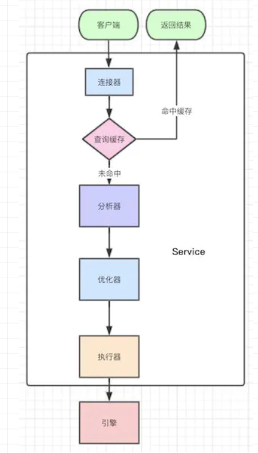

# mysql基础架构

连接器：负责处理数据库的连接请求

> 如何查看空闲连接

==**show processlist**==  查看Command为Sleep的行

注意空闲时长参数==**wait_timeout**== 默认为8小时，如果客户端超过该时间无响应则自动断开

> 除了重新连接还能有别的办法吗？

长连接

缺点：内存彪得很快，mysql执行过程中临时使用的内存是管理在连接对象中的，如果一直使用长连接会导致mysql重启，jvm频繁full gc

方案：

1. 定时断开长连接，使用一段时间后判断一个占用内存大的查询断开连接
2. 执行完较大的查询后执行==**mysql_reset_connection**== 初始化连接资源

> 查询缓存

当执行查询时会来这里看看是否执行过这条语句

但是命中率低得可怕，只要表有任何的更新就会清空这个表的查询缓存

在mysql8.0就取消了

> 接下来的步骤？

词法分析，语法分析

优化器（确认使用哪个索引；决定查询方案：先查哪个表还是先关联）

执行器

数据库的慢日志有个==**rows_examined**==字段，扫描多少行可以看到，还有==**explain**==也可以看到执行计划，我们扫描了多少行。 

# 索引：增加查询速度

## 类型

- 主键索引：创建主键时自动创建，是一种特殊的索引
- 单列索引：一个索引只包含单个列
- 唯一索引：索引值必须唯一，但允许空值
- 组合索引：在多个字段上创建的索引，符合最左匹配原则

> 最左匹配原则

以左边为起点匹配索引，当遇到范围查询时就会停止匹配

## 结构上：B+，hash

> 为什么哈希表、完全平衡二叉树、B树、B+树都可以优化查询，为何Mysql独独喜欢B+树？ 

hash：

1. 容易发生hash冲突，尤其是在数据库这种数据量大的场景
2. 支持快速的精确查找，但是不支持范围查找

适合等值查找较多的场景、

有序数组：

1. 支持等值查找和范围查找
2. 数据修改时发生的结构偏移

适合静态数据的保存，即批量生成后不会再改变，之后只会查询的场景

二叉树：

1. 支持范围查询和精确查询
2. 数据量大时树的深度也很大，查询成本也会变大

B树：

可以使用，比二叉树要矮

相比以上提高了磁盘的IO效率

B+树：

比B树胖，非叶子节点会冗余一份保存到叶子节点中，叶子节点之间使用指针相连

比B树提高了范围查找的效率

> 一个B+树的节点适合保存多少元素

一页或者页的倍数

如果小于一页其实也会读取1页

大于1页如1.2就读2页

> 页的概念？

mysql的基本存储结构

- **各个数据页**可以组成一个**双向链表**
- 而**每个数据页中的记录**又可以组成一个**单向**链表
- 每个数据页都会为存储在它里边儿的记录生成一个**页目录**，在通过**主键**查找某条记录的时候可以在页目录中使用**二分法快速定位**到对应的槽，然后再遍历该槽对应分组中的记录即可快速找到指定的记录
- 以**其他列**(非主键)作为搜索条件：只能从最小记录开始**依次遍历单链表中的每条记录**。

 当执行一条没有优化的查询语句时的流程

1. 定位到所在的页：遍历双向链表
2. 在页中查询响应的记录：遍历单链表

> 回表

当查找普通字段时流程为：

1. 先查找普通字段上的值
2. 找到他的主键id
3. 然后使用主键索引查找对应的值

> 解决方案：覆盖索引（适用于查询字段不是特别多的场景）

将查询的字段创建为索引，[具体](https://blog.csdn.net/qq_15037231/article/details/87891683)为创建联合索引（explain可以发现Using index）

> 查询流程

1. from
2. where
3. group by
4. having
5. select
6. order by

> 失效场景

1. like以%开头
2. or前后没有同时使用索引
3. 不满足最左匹配原则的组合索引
4. 数据出现的隐式转换，如varchar不加引号可能会自动转为int
5. 使用is NULL等空值判断
6. 使用not,<>,!= 改为key<0 or key>0
7. 对索引字段计算
8. 全表扫描比索引快时

 

# 事务

> 四大特性ACID

1. 原子性（atomicity)

一个事务必须被视为一个不可分割的最小工作单元，整个事务中的所有操作要么全部提交成功，要么全部失败回滚，对于一个事务来说，不可能只执行其中的一部分操作。

2. 一致性（consistency)

数据库总是从一个一致性的状态转换到另外一个一致性的状态。在前面的例子中，一致性确保了，即使在执行第三、四条语句之间时系统崩溃，CMBC账户中也不会损失100万，不然lemon要哭死因为事务最终没有提交，所以事务中所做的修改也不会保存到数据库中。

3. 隔离性（isolation)

通常来说，一个事务所做的修改在最终提交以前，对其他事务是不可见的。在前面的例子中，当执行完第三条语句、第四条语句还未开始时，此时如果有其他人也准备给lemon的CMBC账户存钱，那他看到的CMBC账户里还是有100万的。

4. 持久性（durability)

一旦事务提交，则其所做的修改就会永久保存到数据库中。此时即使系统崩溃，修改的数据也不会丢失。

> 脏读，不可重复度，幻读

脏读：

事务A写数据后提交数据前，事务B来读数据，如果这时事务A回撤或者又修改了数据，这时B就出现了脏读

不可重复读：（修改）

事务A第一次读取和第二次读取之间，事务B对数据进行了修改，这时事务A的第二次读取就出现了不可重复读

幻读：（新增或删除）

事务A第一次读取和第二次读取之间，事务B新增了一条数据，这时事务A第二次会多读取到一条数据，就出现了幻读

 

#  数据库引擎

> innoDB和MyISAM区别

前者：

支持事务，行级锁，支持外键，在线热备份，聚簇索引 （数据和索引放到一起，查询快）

后者：

不支持事务，表级锁，不支持外键，不支持备份，压缩表和空间数据索引

 

 

 

 