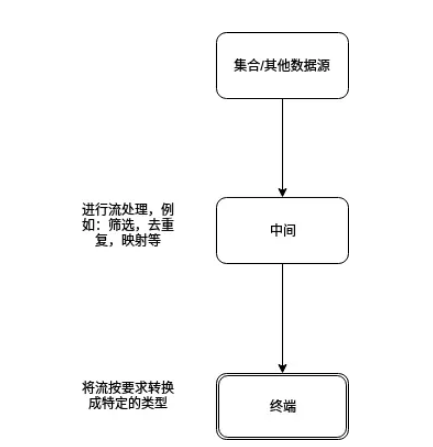
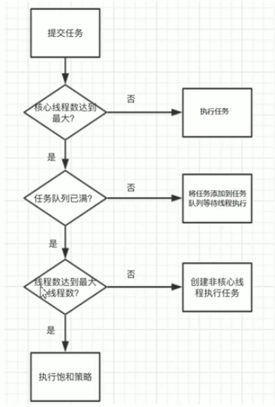
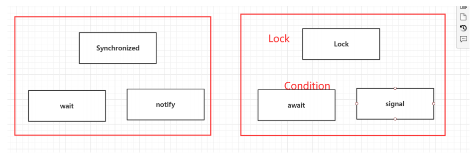

# 集合排序

## 1.自然排序：

参与排序的对象需实现comparable接口,重写其compareTo()方法,方法体中实现对象的比较大小规则

```java
@Override
  public int compareTo(Object o) {
          if(o instanceof Emp){
              Emp emp = (Emp) o;
              return this.age-emp.getAge();//按照年龄升序排序
             //return this.name.compareTo(emp.getName());//换姓名升序排序
          }
          throw new ClassCastException("不能转换为Emp类型的对象...");
}
```

 

## 2.定制排序,或自定义排序

需编写匿名内部类,先new一个Comparator接口的比较器对象c,同时实现compare()其方法; 

然后将比较器对象c传给Collections.sort()方法的参数列表中,实现排序功能;

```java
Collections.sort(list,new Comparator () {
             @Override
              public int compare(Object o1, Object o2) {
                  if(o1 instanceof Emp && o2 instanceof Emp){
                     Emp e1 = (Emp) o1;
                     Emp e2 = (Emp) o2;
                     return e1.getName().compareTo(e2.getName());
                  }
                  throw new ClassCastException("不能转换为Emp类型");
              }
          });
```

#  function 的方法

## Consumer：

提供无返回的函数操作，可以在方法中实现对数据的任何操作

```java
privatestaticvoidtestConsumer2(){
List<Integer>list=newArrayList<>();
Consumer<Integer>consumer=(s)->list.add(s+1);
Stream<Integer>stream=Stream.of(1,2,3,4,5,6,7,8,9);
stream.forEach(consumer);
System.out.println("---------------------");
list.forEach(System.out::println);
}
```


## Supplier

返回指定的类型，类似静态工厂方法，创建一个目标容器

 

```java
Suppelier<Integer> supplier = () -> new Random().nextInt();
supplier.get
```

 

## Predicate 

传入参数判断并返回boolean值

```java
Predicate<Integer> predicate = (t) -> t > 5
Predicate<String>predicate=(s)->s.equals("3");
Stream<String>stringStream=Stream.of("1","2","3","4","5");
Stream<String>stringStream1=stringStream.filter(predicate);
stringStream1.forEach(System.out::println);
```

 

## Function

用于转换数据获取子流

```java
Function<String,Integer>function=String::length;
Stream<String>stringStream=Stream.of("1","222","33","4444444","55555555555");
Stream<Integer>stream=stringStream.map(function);
```


# 流操作

相当于一种高级的迭代器，为java集合提供一种类似sql的集体操作，与常规集合不同的是他可以提供数据的修改



 

注意：流不能重复使用，一个流在赋值给一个变量后只能被使用一次

Stream<String>stream=Stream.of("1","","3","4","5");

这个流只能被使用一次，在使用一次后就会被关闭

原因是大部分流方法都会返回一个新的流，当前流会被关闭，类似于String的操作

```java
list=transactions.stream()
                 .filter(s->s.getYear()==2016)
                 .sorted(Comparator.comparing(Transaction::getValue))
                 .collect(Collectors.toList());
```

可以使用重用流来解决

使用：

1.创建流：

- Stream静态方法；其他类和对象的stream()方法

2.操作流

- filter(Predicate):Stream ：筛选出满足条件的元素
- distinct():Stream：去除相同的元素，根据hashCode和equals方法来判断
- limit(int):Stream：返回指定长度的前几个值
- skip(int):Stream：返回跳过前几个值的流
- sorted():Stream:自定义比较排序
- map(Function):Stream：把流转换成另一个流，一般用于提取

 

终端流：以下操作返回的不再是Stream对象

- anyMath(Predicate)boolean：检查流中是否存在满足条件的元素
- allMatch(Predicate)boolean：检查流中是否全部元素满足条件
- noneMatch(Predicate)boolean：检查流中是否全部元素不满足条件
- findAny()Optional：返回流中随机一个元素
- findFirst()Optional：返回流中第一个元素
- Collect(Collector):对流进行处理

[自定义controller学习](https://www.cnblogs.com/woshimrf/p/java8-learn-collector.html)

[Cllectors方法的学习](https://www.jianshu.com/p/f60b5800f61a)

- toCollection:把流中元素返回到一个集合Collection中
- toList:把流中元素返回到一个List中
- toSet:把流中元素返回到set中
- groupingBy：按照给定的属性为键分组返回
- partitioningBy：按照给定的判断条件对流中元素进行校验并返回一个map类型
- toMap:按照给定的键生成器和值生成器返回一个map
- reduce(BinaryOperator)Optional：把流元素按照某种运算规则组合起来


# 自定义collector

```java
public interface Collector<T, A, R> { 
//容器函数，生成结果容器
Supplier<A> supplier(); 
//累加器，执行具体的累加方法，每当访问一个元素时就执行累加器
BiConsumer<A, T> accumulator(); 
//当并行操作流时合并两个结果容器
BinaryOperator<A> combiner();
//对结果容器进行转换，返回成我们需要的容器
Function<A, R> finisher(); 
//对collector方法的规定，不设置会报异常 ,包含以下三个值
NORDERED--归约结果不受流中项目的遍历和累积顺序的影响
CONCURRENT--accumulator函数可以从多个线程同时调用，且该收集器可以并行归约流。如果收集器没有标为UNORDERED, 那它仅在用于无序数据源时才可以并行归约。
IDENTITY_FINISH--这表明完成器方法返回的函数是一个恒等函数，可以跳过。这种情况下，累加器对象将会直接用做归约过程的最终结果。这也意味着，将累加器A不加检查地转换为结果R是安全的。
Set<Characteristics> characteristics();
 }
T:要收集的对象的泛型
A:累加器在收集过程中用于累计结果的对象
R:收集操作返回的结果
```

 

例：实现列表自动排序成二级目录

```java
new Collector<Category, List<Category>, List<Category>>() {
    @Override
    public Supplier<List<Category>> supplier() {
        return ArrayList::new;
    }
    @Override
    public BiConsumer<List<Category>, Category> accumulator() {
        return (List<Category> listCategory,Category category)->{
            if(category.getFatherid()==0){
                System.out.println("father:"+category);
                listCategory.add(category);
                for(int i = list.indexOf(category);i<list.size();i++){
                    if(list.get(i).getFatherid()==category.getCategory_id()){
                        System.out.println("child:"+list.get(i));
                        listCategory.add(list.get(i));
                    }
                }
            }
        };
    }
    @Override
    public BinaryOperator<List<Category>> combiner() {
        return null;
    }
    @Override
    public Function<List<Category>, List<Category>> finisher() {
        return (i)->i;
    }
    @Override
    public Set<Characteristics> characteristics() {
        return Collections.unmodifiableSet(EnumSet.of(Characteristics.IDENTITY_FINISH));
    }
}

```

# lamdba表达式


使用“(参数)->{代码}”这种代码块来取代匿名类

```java
// Java 8之前：
new Thread(new Runnable() { 
@Override 
public void run() { 
System.out.println("Before Java8, too much code for too little to do"); } }).start(); 
//Java 8方式： 
new Thread( () -> System.out.println("In Java8, Lambda expression rocks !!") ).start();
```


格式：

(params) -> expression

(params) -> statement

(params) -> { statements } 

# Option

[学习链接](https://www.cnblogs.com/zhangboyu/p/7580262.html)

> 类似于一个容器

用途：解决为了维护空指针异常（NullPointerException）而产生的多余代码

```java
String isocode = user.getAddress().getCountry().getIsocode().toUpperCase();
```

如果为了避免空指针异常，则需要做以下处理

```java
if (user != null) {
     Address address = user.getAddress();
     if (address != null) {
         Country country = address.getCountry();
         if (country != null) {
             String isocode = country.getIsocode();
             if (isocode != null) {
                 isocode = isocode.toUpperCase();
             }
         }
     }
 }
```

 

使用Optional来避免空指针异常

```java
Optional<User> opt = Optional.ofNullable(user);
```

 

使用orElse来在值为空时返回另一个值

```java
User result = Optional.ofNullable(user).orElse(user2);
```

 

map() 对值应用(调用)作为参数的函数，然后将返回的值包装在 Optional 中

```java
String email = Optional.ofNullable(user)
       .map(u -> u.getEmail()).orElse("default@gmail.com");
```


# 线程池

[学习链接](https://baijiahao.baidu.com/s?id=1651975178610990562&wfr=spider&for=pc)

使用场景：单个任务处理时间段而任务数量大



 

父接口ExecutorService，有许多继承的接口实现了别的线程池管理功能，具体根据源码的继承实现来学习 

 

## java内部常用的线程池：

FixedThreadPool，SingleThreadExecutor，CachedThreadPool

 

支持自定义的线程池：ThreadPoolExecutor

- 4个核心参数：

- 核心线程数：80 20原则

- 任务队列长度：核心线程数/单个任务执行时间*2

- 最大线程数：（最大任务数-任务队列长度）*单个任务执行时间

- ```java
  // 最大线程到底该如何定义
  // 1、CPU 密集型，几核，就是几，可以保持CPu的效率最高！
  // 2、IO 密集型 > 判断你程序中十分耗IO的线程，
  // 程序 15个大型任务 io十分占用资源！
  ```

- 最大空闲时间：

 

别的参数：

拒绝策略：

- AbortPolicy(抛出一个异常，默认的)
- DiscardPolicy(直接丢弃任务)
- DiscardOldestPolicy（丢弃队列里最老的任务，将当前这个任务继续提交给线程池）
- CallerRunsPolicy（交给线程池调用所在的线程进行处理)

```java
// 单个线程的线程池
ExecutorService threadPool = Executors.newSingleThreadExecutor();
// 创建一个固定的线程池的大小
ExecutorService threadPool = Executors.newFixedThreadPool(5); 
// 可伸缩的
ExecutorService threadPool = Executors.newCachedThreadPool(); 

//创建线程
threadPool.execute(()->{
	System.out.println(Thread.currentThread().getName()+" ok");
});
//关闭线程池
threadPool.shutdown();
```

本质上都是基于以下构建器来创建一个线程池，是一种封装

```java
public ThreadPoolExecutor(int corePoolSize, // 核心线程池大小
                          int maximumPoolSize, // 最大核心线程池大小
                          long keepAliveTime, // 超时了没有人调用就会释放
                          TimeUnit unit, // 超时单位
                          BlockingQueue<Runnable> workQueue, // 阻塞队列
                          ThreadFactory threadFactory, 
                          // 线程工厂：创建线程的，一般不用动
                          RejectedExecutionHandler handle // 拒绝策略)
```

建议直接使用以上方式创建自定义线程池

```java
ExecutorService threadPool = new ThreadPoolExecutor(
                                2,
                                5,
                                3,
                                TimeUnit.SECONDS,
                                new LinkedBlockingDeque<>(3),
                                Executors.defaultThreadFactory(),
                                new ThreadPoolExecutor.DiscardOldestPolicy()); 
```


# JUC编程

## lock




使用：

```java
Lock lock = new ReentrantLock();

在业务代码前加锁
lock.lock(); // 加锁

业务代码结束后解锁
lock.unlock(); // 解锁
```

> 与Synchronized 区别

1、Synchronized 内置的Java关键字， Lock 是一个Java类 

2、Synchronized 无法判断获取锁的状态，Lock 可以判断是否获取到了锁 

3、Synchronized 会自动释放锁，lock 必须要手动释放锁！如果不释放锁，死锁

 4、Synchronized 线程 1（获得锁，阻塞）、线程2（等待，傻傻的等）；Lock锁就不一定会等待下 去；

 5、Synchronized 可重入锁，不可以中断的，非公平；Lock ，可重入锁，可以 判断锁，非公平（可以 自己设置）； 

6、Synchronized 适合锁少量的代码同步问题，Lock 适合锁大量的同步代码！ 

判断中使用while代替if来防止虚假唤醒

## Condition 

```java
//注意获得的是特定锁的Condition对象
Condition condition = lock.newCondition();
//等待
condition.await();
//唤醒
condition.signalAll();
//如何唤醒特定线程？不同线程使用不同的Condition对象
private Condition condition1 = lock.newCondition();
private Condition condition2 = lock.newCondition();
private Condition condition3 = lock.newCondition();
//在实际业务中调用不同Condition对象的唤醒方法
```

## 集合类

集合线程不安全？

1.普通集合类中提供的解决方法：Vector:synchronized方法锁住

2.Collections.synchronizedList(new ArrayList<> ()); :获得一个线程安全的集合

3.JUC提供的线程安全的集合类:new CopyOnWriteArrayList<>()； lock锁锁住


## callable：效率高

```java
//MyThread为自定义实现Callable接口的线程类,需要适配一下才能跑起来
MyThread thread = new MyThread();
FutureTask futureTask = new FutureTask(thread); // 适配类
new Thread(futureTask,"A").start();
```

几个辅助类:

CountDownLatch:减法计数器,保证某些线程必须先执行才能继续

```java
CountDownLatch countDownLatch = new CountDownLatch(6)//初始为6
countDownLatch.countDown(); // 数量-1
countDownLatch.await(); // 等待计数器归零，然后再向下执行
```

CyclicBarrier :加法计数器,统计线程数量

```java
CyclicBarrier cyclicBarrier = new CyclicBarrier(7,()->{
	System.out.println("召唤神龙成功！");
});//创建加法计数器,并且指定到达目标的事件
cyclicBarrier.await(); // 等待
```

Semaphore :信号量,限制线程数

```java
Semaphore semaphore = new Semaphore(3);//限制只有3个线程能执行操作
semaphore.acquire(); //如果可以,获取信号量,否则等待 信号量总数-1
semaphore.release(); //释放信号量 信号量总数+1
```

## 读写锁:ReadWriteLock 

> 可以被多线程同时读取,但只能被一个线程写,内部包含一对锁:读锁和写锁

```java
private ReadWriteLock readWriteLock = new ReentrantReadWriteLock(); //创建一个读写锁

readWriteLock.writeLock().lock(); //把写锁锁住
readWriteLock.writeLock().unlock();// 释放写锁
readWriteLock.readLock().lock(); //锁住读锁
readWriteLock.readLock().unlock(); //释放写锁
```

## BlockingQueue :阻塞队列

> 场景:多线程并发,线程池
>
> 包括四组api

```java
// 队列的大小
ArrayBlockingQueue blockingQueue = new ArrayBlockingQueue<>(3);

 //此时队满队空会抛出异常
(blockingQueue.add("a") //添加
 blockingQueue.remove() //弹出
 
//此时会返回一个返回值
 blockingQueue.offer("a")
 blockingQueue.poll()
 
 //此时会一直阻塞
 blockingQueue.put("a");
 blockingQueue.take()
 
 //等待阻塞,超时就推出
 blockingQueue.offer("d",2,TimeUnit.SECONDS);
blockingQueue.poll(2,TimeUnit.SECONDS);
```

##  同步队列SynchronousQueue 

> 没有容量,进去一个元素后必须等待取出来才能再放元素

```java
BlockingQueue<String> blockingQueue = new SynchronousQueue<>();
```

##  ForkJoin 

> 并行执行任务！提高效率。大数据量，把大任务拆分成小任务
>
> 如何实现

```java
/**
* 求和计算的任务！
* 3000 6000（ForkJoin） 9000（Stream并行流）
* // 如何使用 forkjoin
* // 1、forkjoinPool 通过它来执行
* // 2、计算任务 forkjoinPool.execute(ForkJoinTask task)
* // 3. 计算类要继承 ForkJoinTask
*/
public class ForkJoinDemo extends RecursiveTask<Long> {
    private Long start; // 1
    private Long end; // 1990900000
    // 临界值
    private Long temp = 10000L;
    public ForkJoinDemo(Long start, Long end) {
        this.start = start;
        this.end = end;
    }
    // 计算方法
    @Override
    protected Long compute() {
        if ((end-start)<temp){
            Long sum = 0L;
            for (Long i = start; i <= end; i++) {
            	sum += i;
            }
        	return sum;
        }else { // forkjoin 递归
            long middle = (start + end) / 2; // 中间值
            ForkJoinDemo task1 = new ForkJoinDemo(start, middle);
            task1.fork(); // 拆分任务，把任务压入线程队列
            ForkJoinDemo task2 = new ForkJoinDemo(middle+1, end);
            task2.fork(); // 拆分任务，把任务压入线程队列
            return task1.join() + task2.join();
    	}
    }
}	

//如何运行
ForkJoinTask<Long> task = new ForkJoinDemo(0L, 10_0000_0000L);
ForkJoinTask<Long> submit = forkJoinPool.submit(task);// 提交任务
Long sum = submit.get(); //阻塞等待
```

并行流实现：


```java
long sum = LongStream.rangeClosed(0L,10_0000_0000L).parallel().reduce(0,Long::sum);

//集合转化成并行流，注意要使用线程安全的集合
list1.parallelStream()
```

## java对异步回调的支持：Future

```java
//无返回值的
CompletableFuture<Void> completableFuture =CompletableFuture.runAsync(()->{});
completableFuture.get(); // 获取阻塞执行结果
//有返回值的
CompletableFuture<Integer> completableFuture =CompletableFuture.supplyAsync(()->{return 1024;});
//获取返回值

completableFuture.whenComplete((t, u) -> {
                            System.out.println("t=>" + t); // 正常的返回结果
                            System.out.println("u=>" + u); // 错误信息：
                        }).exceptionally((e) -> {
                            System.out.println(e.getMessage());
                            return 233; // 当出现错误的时候返回
                        }).get()
```

## volatile

> Volatile 是 Java 虚拟机提供轻量级的同步机制 ，在变量中加上volatile可以保证该变量对于别的线程的可见性
>
> 1、保证可见性 
>
> 2、不保证原子性：还是会可能出现多个线程同时操作的情况
>
> 3、禁止指令重排 ：在当前指令的上下文加上一层内存屏障（单例模式）

## 原子类

> 除了加lock锁或者Synchronized ，最高效的方法
>
> 保证操作的原子性

在java.util.concurrent.atomic 包下提供了一些原子类

```java
public class VDemo02 {
// volatile 不保证原子性
// 原子类的 Integer
private volatile static AtomicInteger num = new AtomicInteger();
    public static void add(){
        线程A 线程B
        x=a y=b
        b=1 a=2
        这些类的底层都直接和操作系统挂钩！在内存中修改值！Unsafe类是一个很特殊的存在！
        指令重排
        什么是 指令重排：你写的程序，计算机并不是按照你写的那样去执行的。
        源代码-->编译器优化的重排--> 指令并行也可能会重排--> 内存系统也会重排---> 执行
        处理器在进行指令重排的时候，考虑：数据之间的依赖性！
        可能造成影响的结果： a b x y 这四个值默认都是 0；
        正常的结果： x = 0；y = 0；但是可能由于指令重排
        // num++; // 不是一个原子性操作
        num.getAndIncrement(); // AtomicInteger + 1 方法， CAS
    }
    public static void main(String[] args) {
        //理论上num结果应该为 2 万
        for (int i = 1; i <= 20; i++) {
            new Thread(()->{
                for (int j = 0; j < 1000 ; j++) {
                add();
                }
            }).start();
        }
        while (Thread.activeCount()>2){ // main gc
        	Thread.yield();
        }
        System.out.println(Thread.currentThread().getName() + " " + num);
    }
}
```

## 指令重排

> 写的java程序在编译成字节码时会经过编译有可能变成另一种顺序

## 锁

> 公平锁：保证顺序执行
>
> 非公平锁：不保证顺序执行
>
> 可重入锁：拿到外部的锁自动获得内部锁，解决被锁住的方法的内部调用
>
> 自旋锁：一个线程获取锁时发现锁被其他线程获取则循环等待，直到获取到锁

自旋锁的简单实现

```java
public class SpinLock {

  private AtomicReference<Thread> sign =new AtomicReference<>();

  public void lock(){
    Thread current = Thread.currentThread();
    while(!sign .compareAndSet(null, current)){
    }
  }

  public void unlock (){
    Thread current = Thread.currentThread();
    sign .compareAndSet(current, null);
  }
}
```


## [查看堆栈信息来调试代码](https://blog.csdn.net/eos2009/article/details/78522901?depth_1-utm_source=distribute.pc_relevant.none-task&utm_source=distribute.pc_relevant.none-task)

[线程的堆栈分析](https://blog.csdn.net/weiweicao0429/article/details/53185999?depth_1-utm_source=distribute.pc_relevant.none-task&utm_source=distribute.pc_relevant.none-task)

jps -l ：查看所有的进程号

jstack 进程号 ：打印所有的线程日志

 jstack -l 5659  > 1.txt  ：把信息写进1.txt这个文件