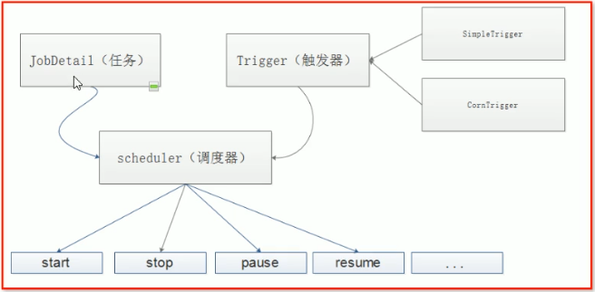

# 基础学习 

[任务调度框架](https://blog.csdn.net/weixin_39723544/article/details/83382000)


核心概念

> Job：自定义要处理的业务内容  实现Job接口
>
> Trigger：触发任务的条件  SimpleTrigger和CronTrigger 
>
> 时间触发器和日程触发器
>
> 调度器：把触发器和任务绑定起来

 



 

常用类：

JobExecutionContext:job有关的上下文

JobDetail：最终的任务对象

JobBuilder：封装任务的工具类

xxBuilder，xxlistener

 

 

实例

```java
public class MyJob implements Job {
    @Override
    public void execute(JobExecutionContext jobExecutionContext) throws JobExecutionException {
        System.out.println("当前时间"+new SimpleDateFormat("yyyy-MM-dd HH:mm:ss").format(new Date()));
    }
}
public class MyScheduler {
    public static void main(String[] args) throws SchedulerException {
        Scheduler scheduler = StdSchedulerFactory.getDefaultScheduler();
        JobDetail detail = JobBuilder.newJob(MyJob.class)
                .withIdentity("job1", "group1")
                .build();
        Trigger trigger = TriggerBuilder.newTrigger()
                .withIdentity("trigger1", "group1")
                .startNow()
                .withSchedule(SimpleScheduleBuilder.simpleSchedule()
                        .withIntervalInSeconds(10)
                        .repeatForever())
                .build();
        scheduler.scheduleJob(detail,trigger);
        scheduler.start();
    }
}

 

```

 

提供了装拆箱机制，在任务类中定义与JobDataMap键同名的属性并生成set方法即可自动设置值

 

注意Trigger中也有一个JobDataMap，如果使用自动装拆箱的话返回的是两个JobDataMap的并集，并且Trigger的优先级比JobDetail高，但是可以通过上下文对象分别获取不同的JobDataMap

 

默认是无状态的Job，信息不能修改

有状态的Job（类似静态变量，能够对一些参数进行重用）

在job类上加上@PersistJobDataAfterExecution注解

并且在任务方法上重新设置值即可保存下来