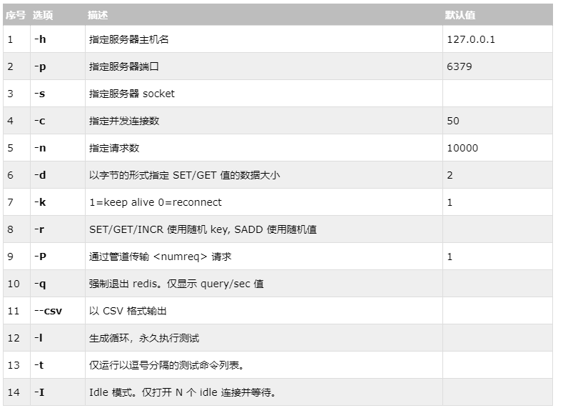

# 基础学习

<https://blog.csdn.net/qq_40140473/article/details/81201017>

<https://blog.csdn.net/hu_zhiting/article/details/81901012>

 

#  相关命令

redis-server.exe redis.windows.conf   启动服务

redis-cli    登录本地服务

redis-cli.exe -h 127.0.0.1 -p 6379  --raw  登录指定地址的服务

auth password 输入密码登入

config get 属性名 获取系统信息 

在客户端进行属性的设置会在服务器启动后就消失,需要持久化设置则需要在外部配置文件设置并且在启动服务时手动指定配置文件

 

get：获取信息

set：设置信息

del：删除信息

select：选择0-15的库

## key：

keys * 显示所有的键名

keys prefix_*  查看前缀为prefix_的键名

type keyname 查看键值的类型

exists keyname 判断是否存在名为keyname的键

key rename oldname newname 给key重命名

move keyname 1移动key到1号库中

flushdb 删除当前数据库的值

flushall 删除所有数据库的键名

 

## String：

strlen key 获取key的长度

mget key1 key2…  同时获取多个键值对

mset key1 value1 key2 value2…同时设置多个键值对

append key 往键追加内容

 

## list：

rpush key value value1 value2... 在key的list尾添加值value...

lpush key value value1 value2... 在key的list头添加值

llen key 获取key的长度

lrange key 0 10 获取0-10的list的值

lindex key 1  返回1号位的元素的值

lrem key 2 value 移除2个值为value

lset key 1 value 给1号位的元素设置值

lpop key 返回并删除list中的首元素

rpop key 返回并删除list中的尾元素

 

## set：

sadd key value value1 value2... 给key中添加value value1 value2值

srem key value 删除key中value的值

smembers key 查看key中的所有值

 

## zset：

zadd  key score1 value1 score2 value2...添加元素以及对应的分数

zrem key value1 value2…删除一个或多个元素

zscore  key value 获取元素对应的分数

zrange key start end 获取排名在某个范围里的值

zrevrange key start end 倒序获取排名在某个范围里的值

zrangebyscore key min max 获取指定分数里面的值

zcount key start end 获取指定分数范围里面的元素个数

zrank key value   获取排名

zrevrank key value 获取倒数的排名

 

## hash：

hset key field value 赋值

hmset key field1 value1  field2 value2 一次给多个字段赋值

hget key field 取值

hmget key field1 field2 一次取多个字段的值

hgetall key 打印所有的键值

hexists key field 判断键是否存在值

hdel key field 删除值

hkeys key 获取所有的键

hvals key 获取所有的值

hlen key 获取长度

数据备份

bgsave/save 把数据保存到dump.rdb文件中

 

性能测试 不需要登录

redis-benchmark get set -n 100000  同时执行100000个请求get set命令检测性能

