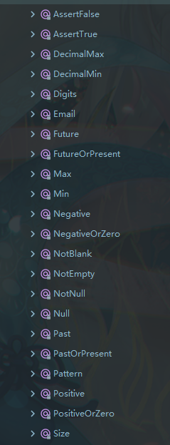
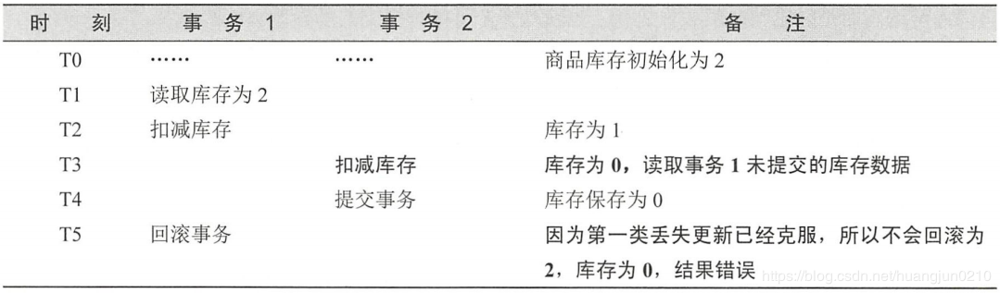
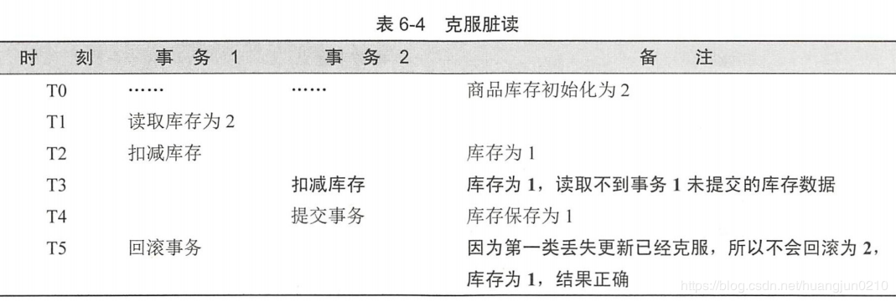
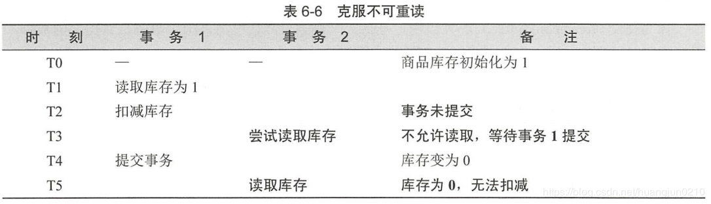
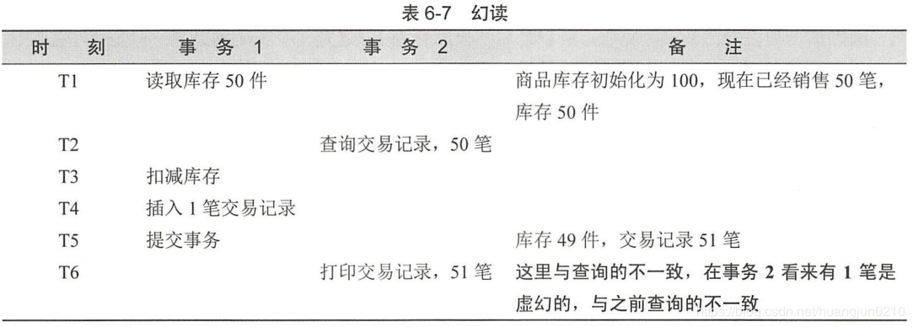
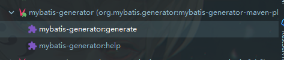

# springboot2.0

### 添加拦截器后静态资源不生效 

[原因](https://blog.csdn.net/qq_20757489/article/details/89462052)

在2.x版本后springboot默认不拦截静态资源，需要在注册拦截器时手动添加静态资源的目录

```java
registry.addInterceptor(new LoginHandlerInterceptor()).addPathPatterns("/**")
.excludePathPatterns("/","/index","/check","/images/**");
```

## 发送put，delete请求失败

[原因](https://blog.csdn.net/c2861024198/article/details/102807710)

springBoot默认关闭了MVC的HiddenHttpMethodFilter，因此需要打开。

```java
spring.mvc.hiddenmethod.filter.enabled=true
```

## 不执行数据库脚本

[原因](https://blog.csdn.net/qq_34054957/article/details/83016411)

springboot2.0之后需要设置

```java
spring.datasource.initialization-mode=always
```

# [Spring参数校验](https://www.bilibili.com/read/cv4308221)

> 基于 javax.validation.constraints下的注解



1. 在实体类上打上以上注解
2. 在需要验证的对象上加上@valid注解

# Springboot对事物的支持

[教程](https://www.cnblogs.com/sharpest/p/7995203.html)

失效的场景：

1. 抛出异常，默认只处理Error异常和运行时异常，对于需要手动处理的异常不会进行事物回滚：

   解决方法：@Transactional(rollbackFor = Exception.class)

   异常不应该在service层捕获，这样也会导致事务失效，应该继续往controller层抛

2. 只能对public方法使用

3. 方法出现内部调用：在类中的a方法调用了类中另一个被注解的b方法，本质是需要代理对象调用才能激活事务，而内部调用不能经过代理对象

   解决方法：在实例类注入一个对象（实际中尽可能避免内部调用）

   ```java
   @Component
   public class TestServiceImpl implements TestService {
       @Resource
       TestMapper testMapper;
   
       @Resource
       TestServiceImpl testServiceImpl;
   
   
       @Transactional
       public void insertTestInnerInvoke() {
           int re = testMapper.insert(new Test(10,20,30));
           if (re > 0) {
               throw new NeedToInterceptException("need intercept");
           }
           testMapper.insert(new Test(210,20,30));
       }
   
   
       public void testInnerInvoke(){
           //内部调用事务方法
           testServiceImpl.insertTestInnerInvoke();
       }
   
   }
   
   ```

   


事物的几个属性

> isolation ：隔离级别
>
> 1. **DEFAULT** ：默认，使用数据库底层的隔离级别，通常就是读写提交
> 2. **READ_UNCOMMITTED** ：未读提交，一个事务可以读取另一个事物修改但还没提交的数据，可能出现脏读和不可重复读，适合对数据一直想没有要求而追求高并发的场景
>
>  
>
> 3. **READ_COMMITTED** ：读写提交，一个事物只能读取另一个事物已经提交过的数据，可以防止脏读
>
>  
>
> 4. **REPEATABLE_READ** ：可重复读，表示一个事物在整个过程可以多次重复执行某个查询，并且每次返回的记录都相等，会忽略掉多次查询之间出现的新增的数据，可以防止脏读和不可重复读，但可能出现幻读
>
>  
>
>  
>
> 5. **SERIALIZABLE** ：串行化，事物将会依次执行，这样就完全避免了事物之间的干扰，但是会严重影响程序的性能
>
> 传播行为：[处理事务方法的嵌套调用，即一个事务方法中调用了另一个事务方法](https://www.jianshu.com/p/ab6195310548)
>
> 1. **REQUIRED** ：如果当前存在事务，则加入该事务，如果没有则创建一个新事务，即共用一个事务，默认
> 2. **SUPPORTS** ：如果当前存在事务，则加入该事务，如果没有则以非事务形式运行
> 3. **MANDATORY** ：如果当前存在事务，则加入该事务，如果当前没有事务则抛出异常
> 4. **REQUIRES_NEW** ：创建一个新事务，如果当前存在事务则把当前事务挂起
> 5. **NOT_SUPPORTED** ：以非事务方式运行，如果当前存在事务则把当前事务挂起
> 6. **NEVER** ：以非事务方式运行，如果当前存在事务则把当前事务挂起
> 7. **NESTED** ：如果当前存在事务则创建一个事务作为嵌套事务来运行，如果没有则创建一个新事务，与**REQUIRED** 不同的是内部事务可以独立于外部事务进行回滚

# springboot中实现aop

[教程](https://blog.csdn.net/qq_33257527/article/details/82561635)


# 自定义属性的配置和环境

```java
@ConfigurationProperties(prefix = "swagger")
```

读取swagger下的同名配置，注意需要set方法注入

```java
@Profile
```

配置在哪个环境下才读取配置类


# 任务

## 异步任务

1.在启动类上加上@EnableAsync

2.在方法上加上@Async注解

 

## 定时任务

1.启动类上加上@EnableScheduling

2.在方法上加上@Scheduled(cron="0 * * * * *")

second, minute, hour, day of month, month, and day of week（0-7 SUN-SAT）

 

<https://blog.csdn.net/smiling_Z/article/details/82828195>

## 邮件任务

1.引入pom文件

```xml
<dependency>
    <groupId>org.springframework.boot</groupId>
    <artifactId>spring-boot-starter-mail</artifactId>
</dependency>
```

2.配置属性：需要去自己的邮箱开启支持服务

```yml
spring:
  mail:
    username: 2928464591@qq.com
    password: vylxryeadhfddffe
    host: smtp.qq.com
    properties:
      mail:
        smtp:
          ssl:
            enable: true

```

 

3.注入操作类完成相关操作

```java
@Autowired
JavaMail  SendermailSender;
```

# 常见类的编写

## 1.拦截器，用于拦截特定请求

```java
public class LoginHandlerInterceptor implements HandlerInterceptor {
    /*
    * 目标方法执行前*/
    @Override
    public boolean preHandle(HttpServletRequest request, HttpServletResponse response, Object handler) throws Exception {
        LogUtils.getLogger().info("进入了登录拦截器");
        LogUtils.getLogger().info(request.getContextPath());
        Object username = request.getSession().getAttribute("username");
        if (username == null) {
            request.getRequestDispatcher("/").forward(request, response);
            return false;
        } else {
            return true;
        }
    }
    /*
	 * 请求处理完成之后*/
    @Override
    public void postHandle(HttpServletRequest request, HttpServletResponse response, Object handler, ModelAndView modelAndView) throws Exception {
    }
    /*
    * 请求完全完成之后*/
    @Override
    public void afterCompletion(HttpServletRequest request, HttpServletResponse response, Object handler, Exception ex) throws Exception {
    }
}
```

## 2.本地化配置器

```java
public class MyLocaleResolver implements LocaleResolver {
    /*
    * 解析请求中携带的区域信息参数*/
    @Override
    public Locale resolveLocale(HttpServletRequest httpServletRequest) {
        //获取自定义请求头信息，l的参数值
        String l=httpServletRequest.getParameter("l");
        //获取系统的默认区域信息
        Locale locale=Locale.getDefault();
        if (!StringUtils.isEmpty(l)){
            String[] split=l.split("_");
            //接收的第一个参数为：语言代码，国家代码
            locale=new Locale(split[0],split[1]);
        }
        return locale;
    }
    @Override
    public void setLocale(HttpServletRequest httpServletRequest, HttpServletResponse httpServletResponse, Locale locale) {
    }
}

```

# 自定义的配置文件

## 1.自定义扩展springmvc配置，类似于以前的spring-mvc.xml文件

```java
@Configuration
public class MySpringMVCConfig implements WebMvcConfigurer {
    /*
    * 添加路径*/
    @Override
    public void addViewControllers(ViewControllerRegistry registry) {
        registry.addViewController("/main").setViewName("login/success");
        registry.addViewController("/index").setViewName("index");
    }
    /*
    * 添加自定义的拦截器*/
    @Override
    public void addInterceptors(InterceptorRegistry registry) {
        registry.addInterceptor(new LoginHandlerInterceptor()).addPathPatterns("/**")
           .excludePathPatterns("/","/index","/check","/asserts/**");
    }
    /*
    * 添加自定义的区域信息解析器*/
    @Bean
    public LocaleResolver localeResolver() { //注意名字相同，否则不生效 
        return new MyLocaleResolver();
    }
}
```


## 2.自定义服务器配置，类似于以前的web.xml文件，常见配置可以去yml文件配置

```java
//自定义的一些类
import com.wangyi.servlet.MyFliter;
import com.wangyi.servlet.MyListener;
import com.wangyi.servlet.MyServlet;
@Configuration
public class MyServerConfig {
//配置servlet
    @Bean
    public ServletRegistrationBean<MyServlet> myServlet() {
        return new ServletRegistrationBean<>(new MyServlet(), "/test");
    }
//配置Filter
    @Bean
    public FilterRegistrationBean<MyFliter> myFilter(){
        FilterRegistrationBean<MyFliter> registrationBean = new FilterRegistrationBean<>();
        registrationBean.setFilter(new MyFliter());
        registrationBean.setUrlPatterns(Arrays.asList("/test"));
        return registrationBean;
    }
//配置listener
    @Bean
    public ServletListenerRegistrationBean<MyListener> myListener() {
        return new ServletListenerRegistrationBean<>(new MyListener());
    }
}

```

# swagger配置

<https://blog.csdn.net/moshowgame/article/details/80265480>

1.导入依赖

```xml
<dependency>
    <groupId>io.springfox</groupId>
    <artifactId>springfox-swagger2</artifactId>
    <version>2.9.2</version>
</dependency>
<dependency>
    <groupId>io.springfox</groupId>
    <artifactId>springfox-swagger-ui</artifactId>
    <version>2.9.2</version>
</dependency>
```

2.创建配置java类

```java
@Configuration
@EnableSwagger2
public class SwaggerConfig {
    /*
     * @Author Wrysunny
     * @Description //TODO 配置swagger的bean实例
     * @Date 16:34 2020/1/5
     * @Param []
     * @return springfox.documentation.spring.web.plugins.Docket
     **/
    @Bean
    public Docket docker(Environment environment) {
        boolean flag = environment.acceptsProfiles(Profiles.of("dev", "test"));
        return new Docket(DocumentationType.SWAGGER_2)
                .apiInfo(apiInfo())
                .groupName("TestController")
                .enable(flag)
                .select()                		.apis(RequestHandlerSelectors.basePackage("com.wangyi.spring_boot_swapper.demo.controller"))//配置扫描的包
                .paths(PathSelectors.any())                              //配置需要被过滤的路径
                .build();
    }
    @Bean
    public Docket docker1(Environment environment) {
        boolean flag = environment.acceptsProfiles(Profiles.of("dev", "test"));
        return new Docket(DocumentationType.SWAGGER_2)
//                .apiInfo(apiInfo())
                .groupName("UserController")
                .enable(flag)
                .select()            .apis(RequestHandlerSelectors.basePackage("com.wangyi.spring_boot_swapper.demo.controller"))
                .paths(PathSelectors.any())
                .build();
    }
    private ApiInfo apiInfo(){
//        作者信息
        Contact contact = new Contact("wangyi","https://github.com/","2928464591@qq.com");
        return new ApiInfo("API文档",
                "个人测试的API",
                "v0.1",
                "https://github.com/",
                contact,
                "apache 2.0",
                "http://www.apache.org/licenses/LICENSE-2.0",
                new ArrayList<>());
    }

}

 

```

3.访问[http://localhost:8080/swagger-ui.html


# springboot配置druid

## 1.编写java配置文件

```
public class DruidConfig {
    /*
     * @Author Wrysunny
     * @Description //TODO 配置druid读取yml文件的属性
     * @Date 13:27 2020/1/4
     * @Param []
     * @return javax.sql.DataSource
     **/
    @ConfigurationProperties(prefix = "spring.datasource")
    @Bean
    public DataSource druid(){
        return new DruidDataSource();
    }
    /*
     * @Author Wrysunny
     * @Description //TODO 配置druid的监控页面
     * @Date 13:27 2020/1/4
     * @Param []
     * @return org.springframework.boot.web.servlet.ServletRegistrationBean<com.alibaba.druid.support.http.StatViewServlet>
     **/
    @Bean
    public ServletRegistrationBean<StatViewServlet> statViewServlet(){
        ServletRegistrationBean<StatViewServlet> bean = new ServletRegistrationBean<>(new StatViewServlet(),"/druid/*");
        Map<String, String> initParams = new HashMap<>();
        initParams.put("loginUsername","admin");
        initParams.put("loginPassword","123");
        initParams.put("allow","");//默认就是允许所有访问
        initParams.put("deny","192.168.15.21");
        bean.setInitParameters(initParams);
        return bean;
    }
    /*
     * @Author Wrysunny
     * @Description //TODO 配置druid的过滤器
     * @Date 13:28 2020/1/4
     * @Param []
     * @return org.springframework.boot.web.servlet.FilterRegistrationBean<com.alibaba.druid.support.http.WebStatFilter>
     **/
    @Bean
    public FilterRegistrationBean<WebStatFilter> webStatFilterFilter(){
        FilterRegistrationBean<WebStatFilter> bean = new FilterRegistrationBean<>(new WebStatFilter());
        Map<String, String> initParams = new HashMap<>();
        initParams.put("exclusions",".js,.css,/druid/*");
        bean.setInitParameters(initParams);
        bean.setUrlPatterns(Collections.singletonList("/*"));
        return bean;
    }
}
```


## 2.去配置文件配置自己需要的属性

```java
spring:
  datasource:
    #   数据源基本配置
    username: root
    password: WANGYI
    driver-class-name: com.mysql.cj.jdbc.Driver
    url: jdbc:mysql://localhost:3306/spring_boot_ssm?serverTimezone=UTC
    type: com.alibaba.druid.pool.DruidDataSource
    #   数据源其他配置
    initialSize: 5
    minIdle: 5
    maxActive: 20
    maxWait: 60000
    timeBetweenEvictionRunsMillis: 60000
    minEvictableIdleTimeMillis: 300000
    validationQuery: SELECT 1 FROM DUAL
    testWhileIdle: true
    testOnBorrow: false
    testOnReturn: false
    poolPreparedStatements: true
#   配置监控统计拦截的filters，去掉后监控界面sql无法统计，'wall'用于防火墙
#    ,wall,log4j
    filters: stat
    maxPoolPreparedStatementPerConnectionSize: 20
    useGlobalDataSourceStat: true
    connectionProperties: druid.stat.mergeSql=true;druid.stat.slowSqlMillis=500
```

# springboot配置Redis

[ssm](https://blog.csdn.net/Evan_QB/article/details/82622755https://blog.csdn.net/qq_42605968/article/details/92759510https://blog.csdn.net/lizhengyu891231/article/details/88598781)

[jedis和lettuce的区别](https://blog.csdn.net/tianyaleixiaowu/article/details/89847286)

 

1.导入依赖

```xml
<dependency>
    <groupId>org.springframework.boot</groupId>
    <artifactId>spring-boot-starter-data-redis</artifactId>
</dependency>
<dependency>
    <groupId>com.alibaba</groupId>
    <artifactId>fastjson</artifactId>
    <version>1.2.61</version>
</dependency>
```

如果使用letture作为redis客户端工具还需要导入

```xml
<dependency>
    <groupId>org.apache.commons</groupId>
    <artifactId>commons-pool2</artifactId>
    <version>2.5.0</version>
</dependency>
```

 

2.配置文件属性

```java
spring:
  redis:
    host: localhost
    port: 6379
    password: WANGYI
    lettuce:
      pool:
        max-active: 8
        max-wait: -1
        max-idle: 500
        min-idle: 0
      shutdown-timeout: 0
```

 

 

3.使用fastjson作为序列化器（新版的fastjson提供了FastJsonRedisSerializer来作为redis的序列化器，可以直接使用）

```java
public class FastJsonRedisSerializer<T> implements RedisSerializer<T> {
    public static final Charset DEFAULT_CHARSET = StandardCharsets.UTF_8;
    private Class<T> clazz;
    public FastJsonRedisSerializer(Class<T> clazz) {
        super();
        this.clazz = clazz;
    }
    @Override
    public byte[] serialize(T t) throws SerializationException {
        if (null == t) {
            return new byte[0];
        }
        return JSON.toJSONString(t, SerializerFeature.WriteClassName).getBytes(DEFAULT_CHARSET);
    }
    @Override
    public T deserialize(byte[] bytes) throws SerializationException {
        if (null == bytes || bytes.length <= 0) {
            return null;
        }
        String str = new String(bytes, DEFAULT_CHARSET);
        return (T) JSON.parseObject(str, clazz);
    }
}
```

4.编写自定义的序列化器

```java
@Configuration
public class RedisConfig {
    @Bean
    public RedisTemplate<String, User> userRedisTemplate(RedisConnectionFactory factory){
        RedisTemplate<String, User> template = new RedisTemplate<>();
        FastJsonRedisSerializer fastJsonRedisSerializer = new FastJsonRedisSerializer(User.class);
        //关联
        template.setConnectionFactory(factory);
        template.setValueSerializer(fastJsonRedisSerializer);
        template.setHashValueSerializer(fastJsonRedisSerializer);
        // key的序列化采用StringRedisSerializer
        template.setKeySerializer(new StringRedisSerializer());
        template.setHashKeySerializer(new StringRedisSerializer());
        return template;
    }
}
```

5.使用自定义的类注入

```java
@Autowired
private RedisTemplate<String, User> redisTemplate;
```


# 文件上传

前端使用FormData:formdata是以name-value模拟键值对返回数据

ajax提交：

```javascript
$.ajax({
    url: '[[@{/image/upload}]]', // 图片上传url
    type: 'POST',
    data: imageData,
    cache: false,
    contentType: false,
    processData: false,
    dataType: 'json',  
}
```

注意不要对请求头和数据进行处理

在配置类中实现项目外部地址的映射

```java
@Configuration
public class SpringMVCConfig implements WebMvcConfigurer {
    @Override
    public void addResourceHandlers(ResourceHandlerRegistry registry) {      registry.addResourceHandler("/upload/**").addResourceLocations("file:H://upload/");
    }
}
```

# springboot关于rabbitmq的配置

[学习链接](https://www.cnblogs.com/linyufeng/p/9885645.html)

1.导入依赖

```xml
<dependency>
    <groupId>org.springframework.boot</groupId>
    <artifactId>spring-boot-starter-amqp</artifactId>
</dependency>
```

 

2.注入rabbitTemplate，所有的操作都是基于此对象完成

```java
@Autowired
private RabbitTemplate rabbitTemplate;
```

 

3.配置json解析器

@Bean

```java
public MessageConverter messageConverter(){
    return new Jackson2JsonMessageConverter();
}
```
4.配置监听

启动类加上注解@EnableRabbit

在需要监听的地方编写方法


```java
@RabbitListener(queues = "a.yi")
public void receive1(Message message,Map<String,Object> map){
    System.out.println("收到消息"+ message.getBody());
    System.out.println(message.getMessageProperties());
    System.out.println(map.toString());
}
```
5.管理组件

注入


# springboot整合elasticsearch

[项目启动报错](https://www.jianshu.com/p/4d6bedded895https://blog.csdn.net/weixin_44408925/article/details/103530652)

[自定义方法要遵守的](https://docs.spring.io/spring-data/elasticsearch/docs/3.2.3.RELEASE/reference/html/#elasticsearch.repositories)

 

1.添加pom依赖，yml文件配置基本属性

```xml
<dependency>
    <groupId>org.springframework.boot</groupId>
    <artifactId>spring-boot-starter-data-elasticsearch</artifactId>
 </dependency>
```

```java
spring:
  data:
    elasticsearch:
      cluster-nodes: 127.0.0.1:9300
```

2.启动类上加入（未解之谜）

```java
System.setProperty("es.set.netty.runtime.available.processors", "false");
```

3.创建实体类

```java
@Document(indexName = "xinhuashudian",type = "book")
public class Book {
    private int id;
    private String name;
    private String author;
}
```

4.创建操作接口

```java
public interface BookRepository extends ElasticsearchRepository<Book, Integer> {
//    扩展的方法需要遵守一定的命名规则
    List<Book> findByNameLike(String name);
}
```

5.注入实例后使用

6.获取数据

<http://localhost:9200/xinhuashudian/book/_search>


# springboot配置mybatis的逆向工程

在pom文件中配置插件

```xml
<build>
		<plugins>
			<plugin>
				<groupId>org.springframework.boot</groupId>
				<artifactId>spring-boot-maven-plugin</artifactId>
			</plugin>
			<plugin>
				<groupId>org.mybatis.generator</groupId>
				<artifactId>mybatis-generator-maven-plugin</artifactId>
				<version>1.3.7</version>
				<configuration>
					<verbose>true</verbose>
					<overwrite>true</overwrite>
					<configurationFile>
						src/main/resources/generatorConfig.xml
					</configurationFile>
				</configuration>
				<dependencies>
					<dependency>
						<groupId>org.mybatis.generator</groupId>
						<artifactId>mybatis-generator-core</artifactId>
						<version>1.3.7</version>
					</dependency>
					<dependency>
						<groupId>mysql</groupId>
						<artifactId>mysql-connector-java</artifactId>
						<version>8.0.15</version>
					</dependency>
				</dependencies>
			</plugin>
		</plugins>
	</build>
```

然后在resource目录下创建generatorconfig.xml 并配置

```xml
<?xml version="1.0" encoding="UTF-8"?>
<!DOCTYPE generatorConfiguration
		PUBLIC "-//mybatis.org//DTD MyBatis Generator Configuration 1.0//EN"
		"http://mybatis.org/dtd/mybatis-generator-config_1_0.dtd">
<generatorConfiguration>
	<context id="testTables" targetRuntime="MyBatis3">
		<commentGenerator>
			<!-- 是否去除自动生成的注释 true：是 ： false:否 -->
			<property name="suppressAllComments" value="true" />
		</commentGenerator>
		<!--数据库连接的信息：驱动类、连接地址、用户名、密码 -->
		<jdbcConnection driverClass="com.mysql.cj.jdbc.Driver"
			connectionURL="jdbc:mysql://localhost:3306/ssm?serverTimezone=UTC" userId="root"
			password="admin">
		</jdbcConnection>
		<!-- 默认false，把JDBC DECIMAL 和 NUMERIC 类型解析为 Integer，为 true时把JDBC DECIMAL 和 
			NUMERIC 类型解析为java.math.BigDecimal -->
		<javaTypeResolver>
			<property name="forceBigDecimals" value="false" />
		</javaTypeResolver>

		<!-- targetProject:生成PO类的位置 -->
		<javaModelGenerator targetPackage="com.taotao.pojo"
			targetProject=".\src\main\java">
			<!-- enableSubPackages:是否让schema作为包的后缀 -->
			<property name="enableSubPackages" value="false" />
			<!-- 从数据库返回的值被清理前后的空格 -->
			<property name="trimStrings" value="true" />
		</javaModelGenerator>
        <!-- targetProject:mapper映射文件生成的位置 -->
		<sqlMapGenerator targetPackage="com.taotao.mapper"
			targetProject=".\src\main\resources">
			<!-- enableSubPackages:是否让schema作为包的后缀 -->
			<property name="enableSubPackages" value="false" />
		</sqlMapGenerator>
		<!-- targetPackage：mapper接口生成的位置 -->
		<javaClientGenerator type="XMLMAPPER"
			targetPackage="com.taotao.mapper" 
			targetProject=".\src\main\java">
			<!-- enableSubPackages:是否让schema作为包的后缀 -->
			<property name="enableSubPackages" value="false" />
		</javaClientGenerator>
		<!-- 指定数据库表 -->
		<!-- <table schema="" tableName="tb_item" domainObjectName="Item"></table> 
			domainObjectName 可以配置生成的pojo名字 
			如不需要example类添加下面四个属性
			enableCountByExample="false" enableDeleteByExample="false"
            enableSelectByExample="false" enableUpdateByExample="false"></table>-->
		<table schema="" tableName="t_employee"></table>
		<table schema="" tableName="t_employee_task"></table>
		<table schema="" tableName="t_female_helth_form"></table>
		<table schema="" tableName="t_male_helth_form"></table>
		<table schema="" tableName="t_task"></table>
		<table schema="" tableName="t_work_card"></table>
	</context>
</generatorConfiguration>
```

然后运行maven项目的插件即可




# springboot配合前端实现websocket

> 1. 导入pom依赖

```xml
<dependency>
    <groupId>org.springframework.boot</groupId>
    <artifactId>spring-boot-starter-websocket</artifactId>
</dependency>
```

> 2. 当使用spring boot内置的服务器时配置

```java
@Configuration
public class WebSocketConfig {
    @Bean
    public ServerEndpointExporter serverEndpointExporter(){
        return new ServerEndpointExporter();
    }
}
```

> 3. 创建websocket服务器的业务逻辑
>
> 五大注解
>
> @ServerEndpoint:配置websocket的访问路径
>
> @OnOpen:当有用户连接时的业务
>
>  @OnClose:有用户断开连接时的业务
>
> @OnMessage:收到客户端发送的信息时
>
>  @OnError:连接出现异常时
>
> 服务器主动推送消息:session.getAsyncRemote().sendText(message) 

```java
@ServerEndpoint("/testsocket")
@Component
@Slf4j
public class MyWebsocketServer {
    /**
     * 存放所有在线的客户端
     */
    private static Map<String, Session> clients = new ConcurrentHashMap<>();

    @OnOpen
    public void onOpen(Session session) {
        System.out.println(session);
        log.info("有新的客户端连接了: {}", session.getId());
        //将新用户存入在线的组
        clients.put(session.getId(), session);
    }

    /**
     * 客户端关闭
     * @param session session
     */
    @OnClose
    public void onClose(Session session) {
        log.info("有用户断开了, id为:{}", session.getId());
        //将掉线的用户移除在线的组里
        clients.remove(session.getId());
    }

    /**
     * 发生错误
     * @param throwable e
     */
    @OnError
    public void onError(Throwable throwable) {
        throwable.printStackTrace();
    }

    /**
     * 收到客户端发来消息
     * @param message  消息对象
     */
    @OnMessage
    public void onMessage(String message,Session session) {
        log.info("服务端收到客户端:"+session.getId()+"发来的消息: {}", message);
        this.sendAll(message);
    }

    /**
     * 群发消息
     * @param message 消息内容
     */
    private void sendAll(String message) {
        for (Map.Entry<String, Session> sessionEntry : clients.entrySet()) {
            sessionEntry.getValue().getAsyncRemote().sendText(message + "return");
        }
    }
}
```

> 前端的js代码
>
> 关键代码;
>
> 判断浏览器是否支持websocket
>
> 与服务端建立连接:socket = new WebSocket("ws://localhost:8080/testsocket");
>
> 关闭连接: socket.close();
>
> 发送消息:socket.send('hello server');
>
> 前端的websocket也支持事件的配置
>
> 打开事件:socket.onopen = function() {}
>
> 收到消息事件:socket.onmessage = function(msg) {}
>
> 关闭事件:socket.onclose = function() {}
>
> 出现异常事件:socket.onerror = function() {}

```javascript
<script>
    var socket;
    function openSocket() {
        if(typeof(WebSocket) == "undefined") {
            console.log("您的浏览器不支持WebSocket");
        }else{
            console.log("您的浏览器支持WebSocket");
            //实现化WebSocket对象，指定要连接的服务器地址与端口  建立连接
            //等同于socket = new WebSocket("ws://localhost:8888/xxxx/im/25");
            //var socketUrl="${request.contextPath}/im/"+$("#userId").val();
            var socketUrl="http://localhost:8080/testsocket";
            socketUrl=socketUrl.replace("https","ws").replace("http","ws");
            console.log(socketUrl);
            if(socket!=null){
                socket.close();
                socket=null;
            }
            socket = new WebSocket(socketUrl);
            //打开事件
            socket.onopen = function() {
                console.log("websocket已打开");
                //socket.send("这是来自客户端的消息" + location.href + new Date());
            };
            //获得消息事件
            socket.onmessage = function(msg) {
                console.log(msg.data);
                //发现消息进入    开始处理前端触发逻辑
            };
            //关闭事件
            socket.onclose = function() {
                console.log("websocket已关闭");
            };
            //发生了错误事件
            socket.onerror = function() {
                console.log("websocket发生了错误");
            }
        }
    }
    function sendMessage() {
        if(typeof(WebSocket) == "undefined") {
            console.log("您的浏览器不支持WebSocket");
        }else {
            console.log("您的浏览器支持WebSocket");
            socket.send('hello server');
        }
    }
</script>
```

# springboot配置文件配置日志

配置一个logback-spring.xml

```xml
<?xml version="1.0" encoding="UTF-8"?>
<!-- 日志级别从低到高分为TRACE < DEBUG < INFO < WARN < ERROR < FATAL，如果设置为WARN，则低于WARN的信息都不会输出 -->
<!-- scan:当此属性设置为true时，配置文件如果发生改变，将会被重新加载，默认值为true -->
<!-- scanPeriod:设置监测配置文件是否有修改的时间间隔，如果没有给出时间单位，默认单位是毫秒。当scan为true时，此属性生效。默认的时间间隔为1分钟。 -->
<!-- debug:当此属性设置为true时，将打印出logback内部日志信息，实时查看logback运行状态。默认值为false。 -->
<configuration  scan="true" scanPeriod="10 seconds">

    <!--<include resource="org/springframework/boot/logging/logback/base.xml" />-->

    <contextName>logback</contextName>
    <!-- name的值是变量的名称，value的值时变量定义的值。通过定义的值会被插入到logger上下文中。定义变量后，可以使“${}”来使用变量。 -->
    <property name="log.path" value="F:/data/log" />

    <!-- 彩色日志 -->
    <!-- 彩色日志依赖的渲染类 -->
    <conversionRule conversionWord="clr" converterClass="org.springframework.boot.logging.logback.ColorConverter" />
    <conversionRule conversionWord="wex" converterClass="org.springframework.boot.logging.logback.WhitespaceThrowableProxyConverter" />
    <conversionRule conversionWord="wEx" converterClass="org.springframework.boot.logging.logback.ExtendedWhitespaceThrowableProxyConverter" />
    <!-- 彩色日志格式 -->
    <property name="CONSOLE_LOG_PATTERN" value="${CONSOLE_LOG_PATTERN:-%clr(%d{yyyy-MM-dd HH:mm:ss.SSS}){faint} %clr(${LOG_LEVEL_PATTERN:-%5p}) %clr(${PID:- }){magenta} %clr(---){faint} %clr([%15.15t]){faint} %clr(%-40.40logger{39}){cyan} %clr(:){faint} %m%n${LOG_EXCEPTION_CONVERSION_WORD:-%wEx}}"/>


    <!--输出到控制台-->
    <appender name="CONSOLE" class="ch.qos.logback.core.ConsoleAppender">
        <!--此日志appender是为开发使用，只配置最底级别，控制台输出的日志级别是大于或等于此级别的日志信息-->
        <filter class="ch.qos.logback.classic.filter.ThresholdFilter">
            <level>info</level>
        </filter>
        <encoder>
            <Pattern>${CONSOLE_LOG_PATTERN}</Pattern>
            <!-- 设置字符集 -->
            <charset>UTF-8</charset>
        </encoder>
    </appender>


    <!--输出到文件-->

    <!-- 时间滚动输出 level为 DEBUG 日志 -->
    <appender name="DEBUG_FILE" class="ch.qos.logback.core.rolling.RollingFileAppender">
        <!-- 正在记录的日志文件的路径及文件名 -->
        <file>${log.path}/log_debug.log</file>
        <!--日志文件输出格式-->
        <encoder>
            <pattern>%d{yyyy-MM-dd HH:mm:ss.SSS} [%thread] %-5level %logger{50} - %msg%n</pattern>
            <charset>UTF-8</charset> <!-- 设置字符集 -->
        </encoder>
        <!-- 日志记录器的滚动策略，按日期，按大小记录 -->
        <rollingPolicy class="ch.qos.logback.core.rolling.TimeBasedRollingPolicy">
            <!-- 日志归档 -->
            <fileNamePattern>${log.path}/debug/log-debug-%d{yyyy-MM-dd}.%i.log</fileNamePattern>
            <timeBasedFileNamingAndTriggeringPolicy class="ch.qos.logback.core.rolling.SizeAndTimeBasedFNATP">
                <maxFileSize>100MB</maxFileSize>
            </timeBasedFileNamingAndTriggeringPolicy>
            <!--日志文件保留天数-->
            <maxHistory>15</maxHistory>
        </rollingPolicy>
        <!-- 此日志文件只记录debug级别的 -->
        <filter class="ch.qos.logback.classic.filter.LevelFilter">
            <level>debug</level>
            <onMatch>ACCEPT</onMatch>
            <onMismatch>DENY</onMismatch>
        </filter>
    </appender>

    <!-- 时间滚动输出 level为 INFO 日志 -->
    <appender name="INFO_FILE" class="ch.qos.logback.core.rolling.RollingFileAppender">
        <!-- 正在记录的日志文件的路径及文件名 -->
        <file>${log.path}/log_info.log</file>
        <!--日志文件输出格式-->
        <encoder>
            <pattern>%d{yyyy-MM-dd HH:mm:ss.SSS} [%thread] %-5level %logger{50} - %msg%n</pattern>
            <charset>UTF-8</charset>
        </encoder>
        <!-- 日志记录器的滚动策略，按日期，按大小记录 -->
        <rollingPolicy class="ch.qos.logback.core.rolling.TimeBasedRollingPolicy">
            <!-- 每天日志归档路径以及格式 -->
            <fileNamePattern>${log.path}/info/log-info-%d{yyyy-MM-dd}.%i.log</fileNamePattern>
            <timeBasedFileNamingAndTriggeringPolicy class="ch.qos.logback.core.rolling.SizeAndTimeBasedFNATP">
                <maxFileSize>100MB</maxFileSize>
            </timeBasedFileNamingAndTriggeringPolicy>
            <!--日志文件保留天数-->
            <maxHistory>15</maxHistory>
        </rollingPolicy>
        <!-- 此日志文件只记录info级别的 -->
        <filter class="ch.qos.logback.classic.filter.LevelFilter">
            <level>info</level>
            <onMatch>ACCEPT</onMatch>
            <onMismatch>DENY</onMismatch>
        </filter>
    </appender>

    <!-- 时间滚动输出 level为 WARN 日志 -->
    <appender name="WARN_FILE" class="ch.qos.logback.core.rolling.RollingFileAppender">
        <!-- 正在记录的日志文件的路径及文件名 -->
        <file>${log.path}/log_warn.log</file>
        <!--日志文件输出格式-->
        <encoder>
            <pattern>%d{yyyy-MM-dd HH:mm:ss.SSS} [%thread] %-5level %logger{50} - %msg%n</pattern>
            <charset>UTF-8</charset> <!-- 此处设置字符集 -->
        </encoder>
        <!-- 日志记录器的滚动策略，按日期，按大小记录 -->
        <rollingPolicy class="ch.qos.logback.core.rolling.TimeBasedRollingPolicy">
            <fileNamePattern>${log.path}/warn/log-warn-%d{yyyy-MM-dd}.%i.log</fileNamePattern>
            <timeBasedFileNamingAndTriggeringPolicy class="ch.qos.logback.core.rolling.SizeAndTimeBasedFNATP">
                <maxFileSize>100MB</maxFileSize>
            </timeBasedFileNamingAndTriggeringPolicy>
            <!--日志文件保留天数-->
            <maxHistory>15</maxHistory>
        </rollingPolicy>
        <!-- 此日志文件只记录warn级别的 -->
        <filter class="ch.qos.logback.classic.filter.LevelFilter">
            <level>warn</level>
            <onMatch>ACCEPT</onMatch>
            <onMismatch>DENY</onMismatch>
        </filter>
    </appender>


    <!-- 时间滚动输出 level为 ERROR 日志 -->
    <appender name="ERROR_FILE" class="ch.qos.logback.core.rolling.RollingFileAppender">
        <!-- 正在记录的日志文件的路径及文件名 -->
        <file>${log.path}/log_error.log</file>
        <!--日志文件输出格式-->
        <encoder>
            <pattern>%d{yyyy-MM-dd HH:mm:ss.SSS} [%thread] %-5level %logger{50} - %msg%n</pattern>
            <charset>UTF-8</charset> <!-- 此处设置字符集 -->
        </encoder>
        <!-- 日志记录器的滚动策略，按日期，按大小记录 -->
        <rollingPolicy class="ch.qos.logback.core.rolling.TimeBasedRollingPolicy">
            <fileNamePattern>${log.path}/error/log-error-%d{yyyy-MM-dd}.%i.log</fileNamePattern>
            <timeBasedFileNamingAndTriggeringPolicy class="ch.qos.logback.core.rolling.SizeAndTimeBasedFNATP">
                <maxFileSize>100MB</maxFileSize>
            </timeBasedFileNamingAndTriggeringPolicy>
            <!--日志文件保留天数-->
            <maxHistory>15</maxHistory>
        </rollingPolicy>
        <!-- 此日志文件只记录ERROR级别的 -->
        <filter class="ch.qos.logback.classic.filter.LevelFilter">
            <level>ERROR</level>
            <onMatch>ACCEPT</onMatch>
            <onMismatch>DENY</onMismatch>
        </filter>
    </appender>

    <!--
        <logger>用来设置某一个包或者具体的某一个类的日志打印级别、
        以及指定<appender>。<logger>仅有一个name属性，
        一个可选的level和一个可选的addtivity属性。
        name:用来指定受此logger约束的某一个包或者具体的某一个类。
        level:用来设置打印级别，大小写无关：TRACE, DEBUG, INFO, WARN, ERROR, ALL 和 OFF，
              还有一个特俗值INHERITED或者同义词NULL，代表强制执行上级的级别。
              如果未设置此属性，那么当前logger将会继承上级的级别。
        addtivity:是否向上级logger传递打印信息。默认是true。
    -->
    <!--<logger name="org.springframework.web" level="info"/>-->
    <!--<logger name="org.springframework.scheduling.annotation.ScheduledAnnotationBeanPostProcessor" level="INFO"/>-->
    <!--
        使用mybatis的时候，sql语句是debug下才会打印，而这里我们只配置了info，所以想要查看sql语句的话，有以下两种操作：
        第一种把<root level="info">改成<root level="DEBUG">这样就会打印sql，不过这样日志那边会出现很多其他消息
        第二种就是单独给dao下目录配置debug模式，代码如下，这样配置sql语句会打印，其他还是正常info级别：
     -->


    <!--
        root节点是必选节点，用来指定最基础的日志输出级别，只有一个level属性
        level:用来设置打印级别，大小写无关：TRACE, DEBUG, INFO, WARN, ERROR, ALL 和 OFF，
        不能设置为INHERITED或者同义词NULL。默认是DEBUG
        可以包含零个或多个元素，标识这个appender将会添加到这个logger。
    -->

    <!--开发环境:打印控制台-->
    <springProfile name="dev">
        <logger name="com.nmys.view" level="debug"/>
    </springProfile>

    <root level="info">
        <appender-ref ref="CONSOLE" />
        <appender-ref ref="DEBUG_FILE" />
        <appender-ref ref="INFO_FILE" />
        <appender-ref ref="WARN_FILE" />
        <appender-ref ref="ERROR_FILE" />
    </root>

    <!--生产环境:输出到文件-->
    <!--<springProfile name="pro">-->
    <!--<root level="info">-->
    <!--<appender-ref ref="CONSOLE" />-->
    <!--<appender-ref ref="DEBUG_FILE" />-->
    <!--<appender-ref ref="INFO_FILE" />-->
    <!--<appender-ref ref="ERROR_FILE" />-->
    <!--<appender-ref ref="WARN_FILE" />-->
    <!--</root>-->
    <!--</springProfile>-->

</configuration>
```

