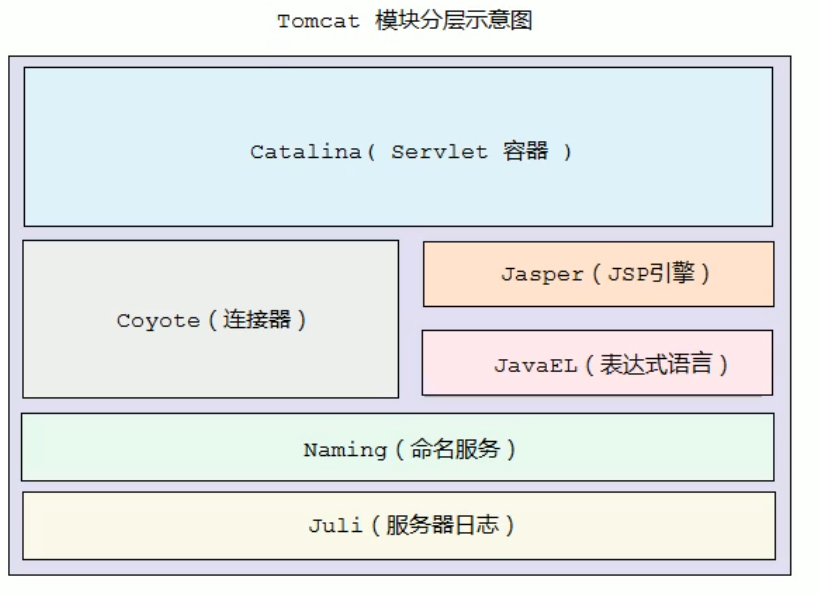

# Tomcat整体架构

> 包括连接器和容器，连接器用于转换请求和响应，容器用于存放已经加载的servlet

# 连接器：Coyote

> 只负责协议接口和IO的相关操作，跟业务类没有任何关系
>
> 一个容器可以对接多个连接器

| IO模型 | 描述                           |
| ------ | ------------------------------ |
| NIO    | 非阻塞IO采用Java NIO实现       |
| NIO2   | 异步IO，采用JDK7的NIO2实现     |
| APR    | Apache的可移植库，需要单独安装 |

| 应用层协议 | 描述                                            |
| ---------- | ----------------------------------------------- |
| HTTP:/1.1  | 大部分web应用的协议                             |
| AJP        | 用于web服务集成以实现对静态资源的优化和集群部署 |
| HTTP:/2    | 下一代的HTTP协议                                |

工作流程

EndPoint:包括两个内部类:Acceptor和SocketProcessor

Acceptor:监听Socket连接请求

SocketProcessor:处理接受到的Socket请求,并且实现了Runnale接口,会被提交到线程池处理

Processor:接收处理完的Socket封装成Tomcat的Request对象

Adapter:把Request对象转换成ServletRequest对象

## servlet容器:Catalina

connector:连接器,用于接受处理ServletRequest传递给容器

Container:负责把请求转发给具体的容器然后返回响应结果

## Container结构

> Engine:整个服务器的引擎
>
> Host:一个项目部署的网站节点
>
> Context:一个单独的项目
>
> Wrapper:代表servlet

# 启动流程:

# 请求流程

处理流程

