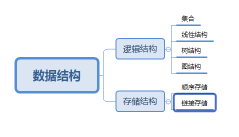
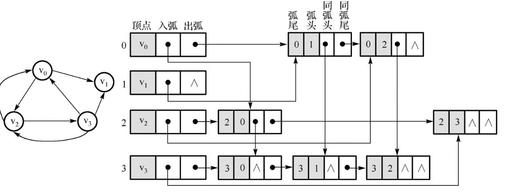
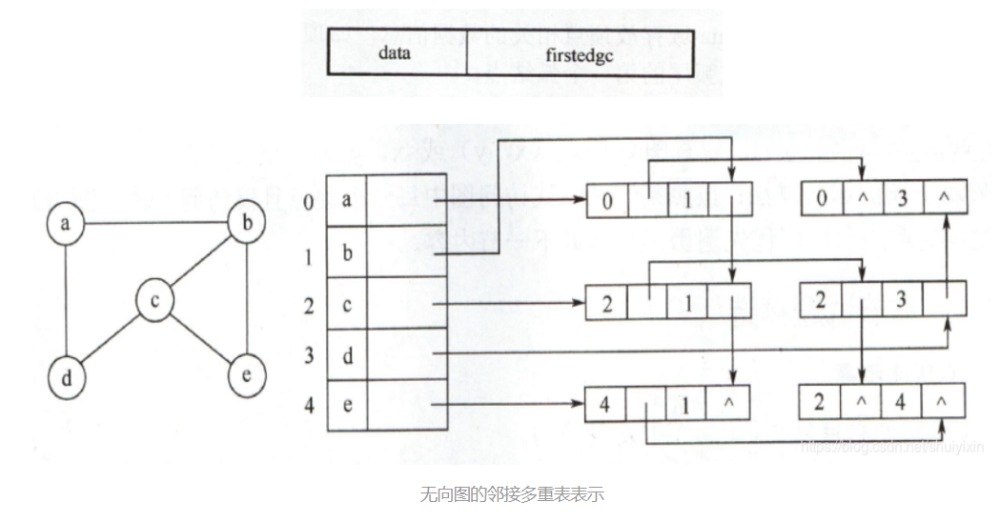

# 基本概念

数据->数据元素->数据项 

算法时间空间复杂度和最好最坏平均情况 

# 线性表

> 定义：是n（n≥0)个具有相同类型的数据元素的有限序列 
>

## 顺序存储结构：顺序表 

- 用一段地址连续的存储单元依次存储线性表的数据元素，即数组
- 要定义数组的最大容量

随机存取：只要确定了一个存取顺序表的起始地址，计算任意一个元素的存储地址的时间都是相等的

## 链接存储结构：链表 

- 用结点结构体来存储，存储的数据包括该结点的数据和下一个结点的地址
- 对链表的结构修改注意摘链顺序，以免造成数据丢失
- 为了操作统一，头结点可以不用来存储数据，只存储下一个结点的位置
- 加入头指针便于操作

 

 

## 扩展：

- 循环链表：把单链表的尾结点的下一个结点指向头结点
- 双链表：修改结点的结构为前一个结点的地址、该结点的数据和下一个结点的地址
- 加入尾指针便于操作

## 另一种形式：静态链表 

- 用数组表示的链表，即定义一个结构体数组，包括数据和下个元素的数组下标。

- 在数组中使用空闲链头指针和数据链头指针，这样相当于在顺序表中使用了间接寻址，能优化顺序表的删除和插入操作

## 对比总结

- 需要频繁查找但很少进行插入和删除操作使用顺序表更好
- 需要频繁插入和删除操作时采用链表更好

# 栈和队列 ：多用于序列的访问 

## 栈：

限定只在表尾进行插入和删除的线性表。 

- 允许插入删除的一端为栈顶，另一端为栈底。
- 只允许后进先出

### 顺序存储结构:顺序栈 

也就是顺序表的简化，只是人工约束用数组的哪一端表示栈顶

 

- 两栈共享空间：本质上还是开辟一个数组空间，但使用数组的始末端来表示两个栈底

栈空：top1=-1；top2=MaxSize

栈满：top1=top2-1

- 使用标志位来判断是对哪个栈进行操作

- 最好在一个栈增长时另一个栈缩短的情况使用，再更复杂的问题时效果会变差

### 栈的链接存储结构：链栈

以链表的头部为栈顶进行插入删除操作

区别：顺序栈有栈满的问题而链栈没有，但链栈的每个节点的空间开销较大，因此在栈的使用过程中元素的数量变化较大时用链栈，反之用顺序栈

## 队列 

- 只允许在一端进行插入操作，另一端进行删除操作的线性表 
- 允许插入的一端为队头，允许删除的一端为队尾
- 只允许先进先出

### 顺序存储结构：循环队列

用数组直接实现队列会出现的问题：出队时需要把每个元素都往前移一位，时间开销增大，而把出队操作改成首指针向上移容易造成“假溢出”

处理办法：把数组看成首尾相连的循环结构

队空：front=rear

队满：（rear+1）%MaxSIze=front

### 链接存储结构：链队列 

链队列相对简单，只是链表的定向约束

区别：与栈类似

# 字符串和多维数组 

## 字符串：

### 模式匹配：

给定两个字符串S和T，在主串S中寻找子串T的过程称为模式匹配

### BF算法：

从主串S的第一个字符开始和模式T的第一个字符进行比较，若相等则继续比较二者的后续字符；否则从主串的第二个字符开始和模式T的第一个字符进行比较，重复上述过程直到S或T中所有字符比较完毕

### KMP算法：

与BF算法相比主要是在于回溯的处理，在S[i]和T[i]匹配失败后下标i不回溯，下标j回溯到某个位置k

## 多维数组： 

一般不在数组中执行插入和删除操作，数组常用的操作有读写

采用顺序存储结构

需将多维数组映射到一维结构

按行优先存储：先存储行后存储列

按列优先存储：先存储列后存储行

 

矩阵的压缩存储：用于分布有一定规律的特殊矩阵

基本思想：

为多个值相同的元素之分配一个存储空间

对零元素不分配存储空间

### 对称矩阵

在一个n阶方阵中有aij=aji，即矩阵元素关于主对角线对称

只需要存储下三角部分包括主对角线即可

数组下标k=i×(i-1)/2+j-1

### 三角矩阵

与对称矩阵类似，不同之处在于其中一个三角形半区只存储了一个常数c 

### 对角矩阵（带状矩阵） 

所有非零元素集中在以主对角线为中心的带状区域，除了主对角线和他的上下方若干条对角线的元素外其他都为0

方法：

1：把带状区域立起来压缩成一个较小的矩阵

2：直接按行存取非0元素

### 稀疏矩阵 

### 零元素居多的矩阵

存储方法：存储非零元素的值，行号和列号

三元组表：稀疏矩阵的非零元素对应的三元组的集合
 顺序存储结构：三元组顺序表

但还要存储该矩阵的行数列数和非零元素的个数

链接存储结构：十字链表

存储方法：存储非零元素的三元组，同一行的下一个三元组地址，同一列的下一个三元组地址

区别：顺序链表用于对存储空间有要求的情况，链接存储用于对矩阵的加法、乘法等操作

# 树和二叉树

## 树：

用于描述具有层次关系的数据结构

- 每个数据元素称为结点
- 每个非空树满足的条件：

1. 有且仅有一个特定的根结点
2. 除根结点以外的其他其余结点被分为m个互不相交的优先集合，其中每个集合都是一棵树，并称为这个根结点的子树

### 基本概念

结点的度：某结点的拥有子树的个数

树的度：树中各结点度的最大值

叶子节点：度为0的结点

分支结点：度不为0的结点

孩子结点：某结点的子树的根结点

双亲结点：与孩子结点相反

兄弟结点：具有同一个双亲结点

路径：树的结点序列n1,n2,…nk满足ni是ni+1双亲

路径长度：路径上经过的边数

祖先：路径初始结点

子孙：路径经过结点

结点层数：根结点的层数为1，其他向下递增

树的深度：结点的最大层数

层序编号：将树中结点按上层到下层，同层从左到右的次序从1开始编号

有序树：一棵树结点的各子树从左到右都是有次序的，即交换了结点各子树的相对位置，则构成不同的数

无序树：与有序树相对

森林：m颗互不相交的树的集合构成

### 树的遍历操作 

- 前序遍历：按从左到右的顺序前序遍历根结点的每颗子树
- 后续遍历：按从左到右的顺序后续遍历根结点的每颗子树
- 层序遍历：从第一层开始自上而下逐层遍历，同层的从左到右逐个遍历

实现思路：访问某个结点时把他的左右孩子都压入队列，然后每次访问队列的头结点直到队列为空

### 树的存储结构： 

- 双亲表示法：实质为静态链表，每个节点结构由数据域和双亲地址组成

这种存储方法只存储了双亲关系，对某结点的双亲和查找跟结点的等操作很方便，求某结点的孩子只需遍历整个数组，但是不能反映各兄弟结点的关系。

在每个节点再增加一个存放第一个孩子或者存放右兄弟的域

- 孩子表示法：基于多个指针域的链表

- 多重链表表示法：

1：孩子指针域的个数等于该结点的度

指针域包括数据域，该结点的度域和每个孩子结点域

2：孩子指针域的个数等于这颗树的度

指针域包括数据域和每个孩子结点域

区别：1方法一定程度下节约了存储空间，但是实现较为困难；2方法牺牲了一点存储空间来实现操作，适用于各节点度差别不大的树

- 孩子链表表示法：用多个单链表表示树

每个节点包括数据域和下一个兄弟结点地址域

在孩子链表表示法中查找双亲比较困难

- 双亲孩子表示法

基于孩子链表表示法，在每个节点数组元素新增双亲结点的地址

 

- 孩子兄弟表示法

链表每个节点包括数据域，第一个孩子结点地址和右兄弟结点地址

便于实现树的各种操作

### 二叉树 

该树有空树或者由一个根结点和两颗互不相交的、分别称为根结点的左子树和右子树的二叉树构成

特点：

- 每个节点最多有两颗子树，即二叉树中不存在度大于2的结点
- 二叉树是有序的，次序不可以任意颠倒

二叉树的基本性质

1. 二叉树的第i层最多有2i-1个结点
2. 在一棵深度为k的二叉树中最多有2k-1个结点，最少有k个结点
3. 在一棵二叉树中如果叶子结点的个数为n0，度为2的结点的个数为n2，则n0=n2+1
4. 具有n个结点的完全二叉树的深度为[log2n]+1
5. 对一棵具有n个结点的完全二叉树中的结点从1开始按层序编号，则对于任意编号的i为：

- 如果i>1，则结点i的双亲编号为[i/2]；否则结点i为根结点，无双亲
- 如果2i≤n，则结点i的左孩子编号为2i；否则结点i无左孩子
- 如果2i+1≤n，则结点i的右孩子编号为2i+1，否则结点无右孩子

### 斜树

所有结点只有左节点或者右节点的二叉树

满二叉树：所有分支结点都存在左子树和右子树并且所有叶子都在同一层上

完全二叉树：对一棵二叉树按层序编号，如果编号为i的结点与同样深度的满二叉树中编号i的结点在二叉树的位置完全一样

1. 叶子结点只能出现在最下两层并且最下层的叶子结点都集中在左侧连续的位置
2. 如果有度为1的结点只能有一个，并且该结点只能有左孩子

### 存储方式

二叉链表：结点包括数据域，左孩子结点地址，右孩子结点地址

三叉链表：相比二叉链表新增双亲结点地址

线索链表：用于访问某种遍历序列中该结点的前驱和后继，与二叉链表相比增加了左右标志位，用于标识指针域指向的是左右孩子还是前驱后继

若结点有左子树，则其lchild域指示其左孩子，否则令lchild域指示其前驱；若结点有右子树，则其rchild域指示其右孩子，否则令rchild指示其后继

### 访问方法：

#### •前序遍历：

1.访问根结点的数据

2.递归访问左子树

3.递归访问右子树

#### •中序遍历：

1.递归访问左子树

2.访问根结点的数据

3.递归访问右子树

#### •后序遍历：

1.递归访问左子树

2.递归访问右子树

3.访问根结点的数据

 

#### 非递归方法访问：递归方法效率较低

前序遍历：

1.栈s 初始化

2.循环直到 bt 为空且栈s 为空

​        2.1当 bt 不空时循环

​            2.1.1 输出 bt->data;

​            2.1.2 将指针 bt 保存到栈中

​            2.1.3 继续遍历 bt 的左子树

​        2.2 如果栈s 不空,则

​            2.2.1 将栈顶元素弹出至 bt

​            2.2.2 准备遍历 bt 的右子树;

中序遍历：

1.栈s 初始化

2.循环直到 bt 为空且栈s 为空

​        2.1当 bt 不空时循环

​            2.1.1 将指针 bt 保存到栈中

​            2.1.2 继续遍历 bt 的左子树

​        2.2 如果栈s 不空,则

​            2.2.1 将栈顶元素弹出至 bt

​            2.2.2 输出 bt->data;

​            2.2.3 准备遍历 bt 的右子树;

 

后序遍历：

1.栈s 初始化;

2.循环直到 bt 为空且栈s 为空

​      2.1当 bt 非空时循环

​           2.1.1将 bt 连同标志 flag=1 人栈;

​           2.1.2 继续遍历 bt 的左子树

​      2.2 当栈s 非空且栈顶元素的标志为2时,出栈并输出栈顶结点;

​      2.3 若栈非空,将栈顶元素的标志改为 2,准备遍历栈顶结点的右子树;

 

 

### 哈夫曼树（最优二叉树）：

- 权值：对叶子结点赋予的一个有意义的数值
- 带权路径长度：所有叶子节点的权值与路径的乘积之和
- 带权路径最小：权值越大的结点越靠近根结点，权值越小的结点越远离根结点
- 数据结构：结点数组，结点结构包括数据域，左右孩子结点域，双亲域

每次合并数组中最小的两个结点

# 图 

- 顶点：图的数据元素
- G=(V,E)
- 其中G表示图，V表示图中顶点的集合，E表示图中顶点边的集合
- 有向图：图的任意两个顶点之间的边为有向边
- 无向图：图的任意两个顶点之间的边为无向边
- 简单图：不存在顶点到其自身的图，且同一条边不反复出现
- 邻接：若两个顶点之间存在边，则称两个顶点互相邻接
- 依附：两个顶点之间的边依附于两个顶点
- 无向完全图：无向图中任意两个顶点之间都存在边
- 含有n个结点的无向完全图有n×（n-1）/2条边
- 有向完全图：有向图中任意两个节点之间都存在方向互为相反的两条弧
- 含有n个结点的有向完全图有n×（n-1）条边
- 顶点的度：无向图中依附于该顶点的边的个数
- 顶点的入度：有向图中以该顶点为弧头的弧数
- 顶点的出度：有向图中以该顶点为弧尾的弧数
- 权值：边上具有意义的数值
- 网：边上带权值的图
- 路径：图中任意两个顶点之间的顶点序列
- 路径长度：有向图中路径上边的数目
- 回路：第一个顶点和最后一个顶点相同的路径
- 简单路径：在路径序列中顶点不重复出现的路径
- 简单回路：除了第一个顶点和最后一个顶点之外其他顶点不重复出现
- 子图：一个图是另一个图的一部分
- 连通图：无向图中任意顶点之间都有路径
- 联通分量：非联通图的极大联通子图
- 强联通图：有向图中对任意顶点均有路径
- 强联通分量：非强连通图的极大联通子图
- 生成树：一个具有n个顶点的图的一个极小联通子图，有且只有n-1条边

## 图的遍历操作

设置标志位判断结点是否被访问过

### •深度优先遍历：栈

1.访问顶点v

2.从v的未访问的邻接点中选取一个顶点w，从w开始深度优先遍历

3.重复上述两步直到所有顶点都被访问到

### •广度优先遍历：队列

1.访问顶点v

2.依次访问v的各个未被访问的邻接点

3.再依次访问他们未被访问的邻接点

## 图的存储结构：

### •邻接矩阵：

用一个一维数组来存储图中顶点的数据，用一个二维数组来存储图中边的信息，若是网图还要在二维数组中对应位置存储边的权值

无向图的邻接矩阵一定是对称矩阵，有向图的邻接矩阵不一定是

1.无向图中顶点i的度等于邻接矩阵第i行非零元素的个数，有向图中顶点i的出度等于邻接矩阵的第i行的非零元素的个数，入度等于第i列的非零元素的个数

2.判断顶点i，j之间是否存在边，只需测试邻接矩阵中相应位置的元素arc[i][j]是否为0

3.找顶点i的所有邻接点可依次判别顶点i与其它顶点是否有边

 

### •邻接表：

用一个结点数组来存储所有的顶点，每个顶点包括数据域和邻接域，用一个单链表来存储每个顶点的顶点链，网图还可以加上权值域

1.无向图中顶点i的度等于顶点i的边表中的结点个数。有向图顶点i的出度等于顶点i的出度等于顶点i的出边表的结点个数，顶点i的入度等于个顶点的出边表中以i为终点的个数

2.判断顶点i，j之间是否存在边，只需要测试顶点i的出边表中是否存在数据域为j的结点

3.找顶点i的所有邻接点只需要遍历顶点i的出边表

 

### •十字链表：

主要用于有向图

 

[十字链表学习链接](https://www.cnblogs.com/zyl905487045/p/7815429.html)

### •邻接多重表：

用于无向图 

 

[临接图学习](https://blog.csdn.net/shuiyixin/article/details/83721254)

 

邻接矩阵和邻接表的比较

1.图越稠密邻接矩阵的空间效率越高

2.对于查找算法来说邻接矩阵的时间效率较低

## 最小生成树

G=(V,E)

一个无向联通网生成树上各边的权值之和最小的生成树为最小生成树

### Prim算法： 

1. 图的所有顶点集合为VV；初始令集合u={s},v=V−uu={s},v=V−u;

2. 在两个集合u,vu,v能够组成的边中，选择一条代价最小的边(u0,v0)(u0,v0)，加入到最小生成树中，并把v0v0并入到集合u中。

3. 重复上述步骤，直到最小生成树有n-1条边或者n个顶点为止。

   

![(assets/clip_image001-1583763892369.png)  (Al)  (AS)  (C,5)  (C,6)  僬 5 ）  (CA)  连 通 网 G  5 ）  6 ）  1 ． 初 始 u ： },v ： { B ℃ p 无 F}; 顶 点 B 下 方 (A"), 表  示 与 集 合 u 中 A 的 代 价 为 6 作 为 最 小 代 价 边 ·  选 择 最 小 的 代 价 边 （ A ， C), 把 c 并 入 到 集 合 u 中 ．  3.u={A,C,F},v={B,D,E}; 更 新 v 中 顶 点 与  集 合 u 的 最 小 的 代 价 边 ； 选 择 最 小 代 价  边 (F,D),D 并 入 u.  ℃ 5 ）  3 ）  4.u={A,C,F,D},v={B,E}; 更 新 v 中 顶 点 与  集 合 u 的 最 小 的 代 价 边 ； 选 择 最 小 代 价  边 (C,B),B 并 入 u.  2.u={A,C},v={B,D,E,F}; 更 新 v 中 顶 点 与  集 合 u 的 最 小 的 代 价 边 ； 例 如 ： 顶 点 E 之  前 为 （ A ), 更 新 为 （ c ， 6 ） ； 选 择 最 小 代  价 边 (C,F),F 并 入 u.  5.u={A,C,F,D,B},v={E}; 更 新 v 中 顶 点 与  集 合 u 的 最 小 的 代 价 边 ； 选 择 最 小 代 价  边 (B,E),E 并 入 u. ](file:///C:/Users/wy292/AppData/Local/Temp/msohtmlclip1/01/clip_image001.png) 

### Kruskal算法：

1. 把图中的所有边按代价从小到大排序； 
2. 把图中的n个顶点看成独立的n棵树组成的森林； 
3. 按权值从小到大选择边，所选的边连接的两个顶点ui,viui,vi,应属于两颗不同的树，则成为最小生成树的一条边，并将这两颗树合并作为一颗树。 
4. 重复(3),直到所有顶点都在一颗树内或者有n-1条边为止。

![连 通 网 G  3 ． 选 择 代 价 最 小 的 边 （ B ， E); 并 保 证 B ， E  不 在 同 一 颗 树 上 ， 然 后 合 并 3 ， E  1 ． 选 择 代 价 最 小 的 边 （ A ， C); 并 保 证 A ， c  不 在 同 一 颗 树 上 ， 然 后 合 并 A ， c  2 ． 选 择 代 价 最 小 的 边 （ D 旧 ； 并 保 证 p ， F  不 在 同 一 颗 树 上 然 后 合 并 D ， F  4 ， 选 择 代 价 最 小 的 边 （ c ， F); 并 保 证 c ， F 5. 选 择 代 价 最 小 的 边 （ A ， D), 顶 点 A ， D 在 同 一 树 上 ， 丢 年  不 在 同 一 颗 树 上 ， 然 后 合 并 c, 下 所 在 的 选 择 最 小 的 边 ℃ D), 顶 点 CD 在 同 一 顆 树 上 ， 丢 弃 ；  选 择 最 小 的 迦 B ， C), 顶 点 B,c 不 在 同 一 树 上 ， 加 入 此 边 ， 然  后 合 并 旺 所 在 的 树 毗 时 所 有 顶 点 在 同 一 颗 树 上 ， 返 回 ； ](assets/clip_image001-1583763905451.png) 

[学习链接](https://blog.csdn.net/a2392008643/article/details/81781766)

## 最短路径

两顶点之间经历的边数最少的路径或者是两顶点之间经历的权值之和最小的路径

### Dijkstra算法

：单源点最短路径问题

从根顶点开始每次把根顶点到其他顶点的最短边加入到集合中

 

### Floyd算法

:对任意顶点求最短路径

## AOV网

在一个表示工程的有向图中，用顶点表示活动，用弧表示活动之间的优先关系

特点：

表示活动之间存在的某种制约关系

不能出现回路

拓扑排序思想：不唯一

⑴ 从AOV网中选择一个没有前驱的顶点并且输出；

⑵ 从AOV网中删去该顶点，并且删去所有以该顶点为尾的弧；

⑶ 重复上述两步，直到全部顶点都被输出，或AOV网中不存在没有前驱的顶点。 

 

AOE网：在一个表示工程的带权有向图中，用顶点表示事件，用有向边表示活动，边上的权值表示活动的持续时间

AOE网的性质：

⑴ 只有在某顶点所代表的事件发生后，从该顶点出发的各活动才能开始；

⑵ 只有在进入某顶点的各活动都结束，该顶点所代表的事件才能发生。

事件的最早发生时间ve[k] 

事件的最迟发生时间vl[k] 

活动的最早开始时间e[i] 

活动的最晚开始时间l[i]