# 模块设置

## 组织管理：

包括机构和岗位信息，管理岗位编制，

## 人事管理

管理人事档案，处理入、转、调、离业务流程，分析人事异动情况，生成人事业务报告

## 员工关系：

管理员工合同协议，处理劳动合同的签订，续签，终止，管理员工调查问卷

## 考勤管理

设置考勤班次，管理考勤排班，计算出勤明细，处理出勤异常，生成考勤报表，输出薪资计算数据

## 薪酬管理

建立薪资体系，执行工资核算以及发放审核，生成工资报表

## 社保福利

设置缴费基数，管理社保公积金增员减员，生成相关报表，记录社保理赔

## 招聘管理

审核招聘需求，生成招聘计划，管理应聘简历，安排面试，审核录用offer，完成入职转档，生成统计报表

## 培训管理

审核培训需求，指定培训计划，管理培训资源，安排培训课程，发起培训活动，记录培训结果

## 绩效考核

生成绩效考核方案，发起考核流程，审核修正考核结果，支持强制绩效分布

---

# 详细说明

## 登录首页

显示以下相关信息：

- 以下信息分别以标签格显示

- [ ] 员工总数

- [ ] 试用期员工数

- [ ] 本月入职员工数

- [ ] 本月离职员工数

- 以下信息分别以饼状图显示

- [ ] 学历统计

- [ ] 司龄统计

- [ ] 年龄统计

- 以下信息在同一个柱状图中显示

- [ ] 月末人数

- [ ] 入职人数

- [ ] 离职人数

- 

- [ ] 显示当前月份的日历

- 以下信息以百分比形式显示

- [ ] 当天应出勤人数

- [ ] 实际出勤人数
- [ ] 迟到
- [ ] 出差

- 以下信息以方格显示
- [ ] 年假
- [ ] 事假
- [ ] 病假
- [ ] 产假
- [ ] 其他假
- [ ] 调休

- 以下信息以标签显示

- [ ] 待转正人数
- [ ] 离职申请数
- [ ] 合同到期人数
- [ ] 本月生日人数

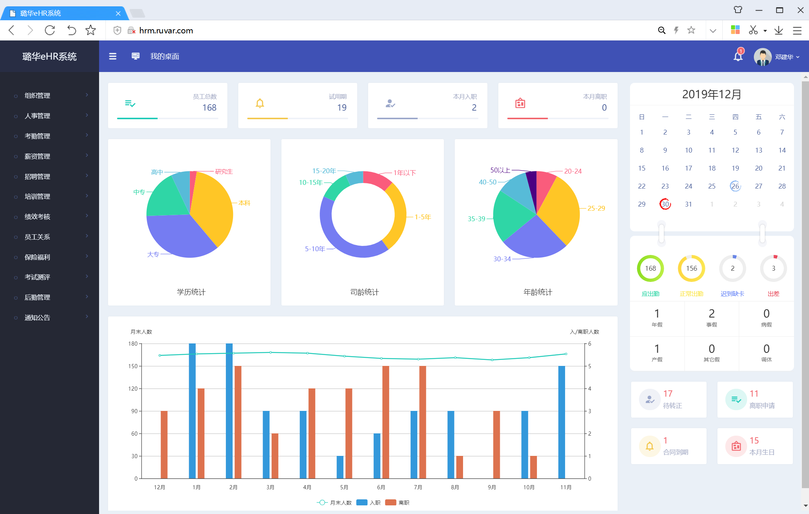 

## 组织管理

- 部门：

- [ ] 实现部门的分级设置显示
- [ ] 实现部门的增加
- [ ] 实现部门相关信息的修改
- [ ] 实现部门的删除（删除父部门会删除所有的子部门，同时相关部门的员工信息也要修改）
- [ ] 批量操作

- 岗位

- [ ] 实现岗位的显示
- [ ] 显示总岗位表
- [ ] 按照部门来分别显示其中的岗位
- [ ] 实现岗位的查询
- [ ] 实现岗位的增加
- [ ] 实现岗位的信息修改
- [ ] 实现岗位的删除（删除岗位时要修改相关岗位员工的信息）
- [ ] 批量操作

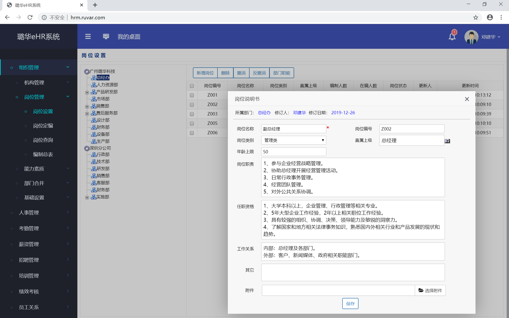 

## 人事管理

- [ ] 按部门来管理相关人员的个人信息
- [ ] 员工档案关联相关的人事活动信息（任职记录，调动记录，奖惩记录，培训记录，绩效考核记录，合同签订记录）
- [ ] 支持部分档案信息的修改
- [ ] 支持员工档案信息的增加
- [ ] 批量操作
- [ ] 高级操作的审核（转正，离职）

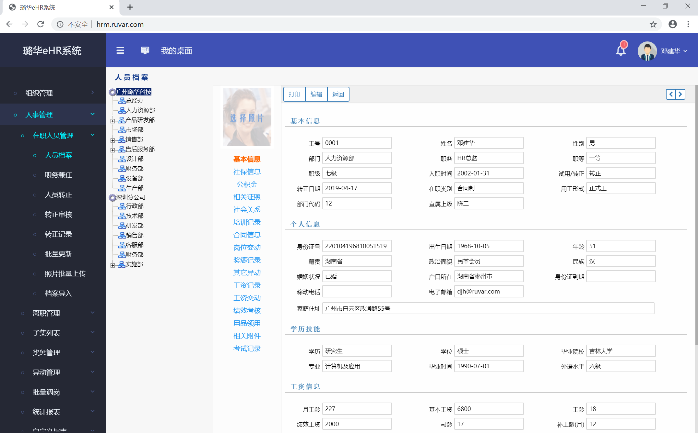 

## 考勤管理

- [ ] 打卡班次的定义
- [ ] 打卡班次的显示
- [ ] 打卡班次的修改
- [ ] 打卡班次的删除
- [ ] 批量操作
- [ ] 相关数据的汇总显示

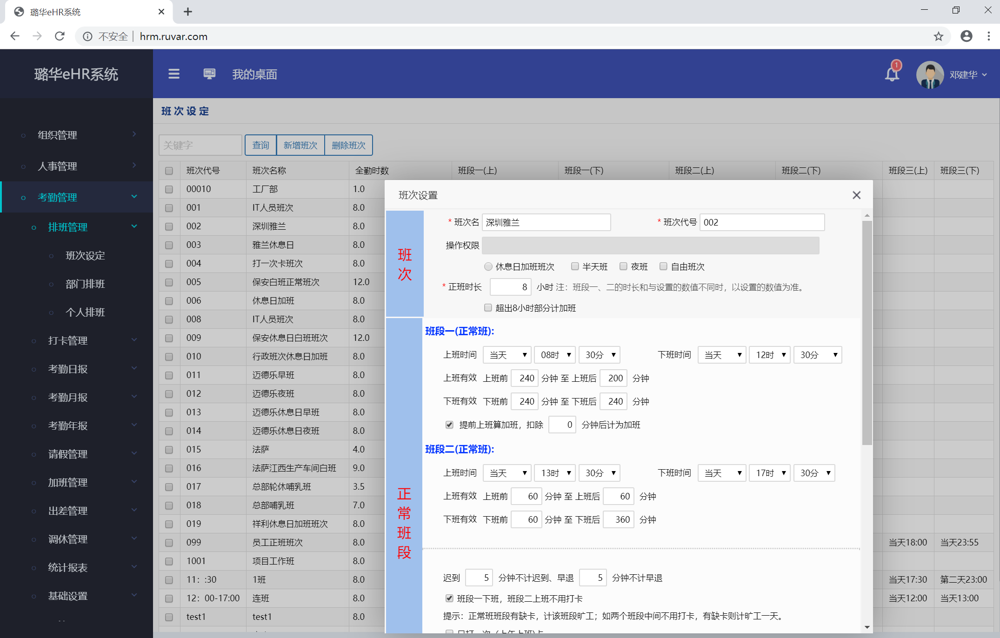 

## 薪资管理

- [ ] 支持自定义工资方案，工资项目，工资计算公式
- [ ] 查看每个员工的相关账套
- [ ] 查看相关部门的账单表

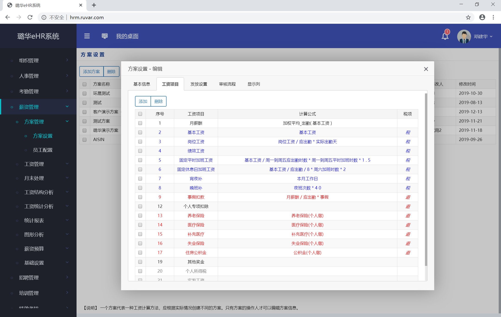 

## 招聘管理

- [ ] 邮箱邮件的查看
- [ ] 邮件模板的生成
- [ ] 面试任务的生成以及消息的发送

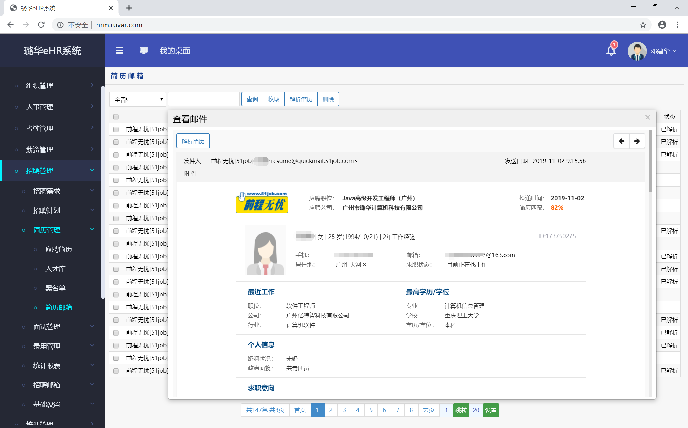 

## 培训管理

- [ ] 培训计划的生成
- [ ] 培训信息的管理

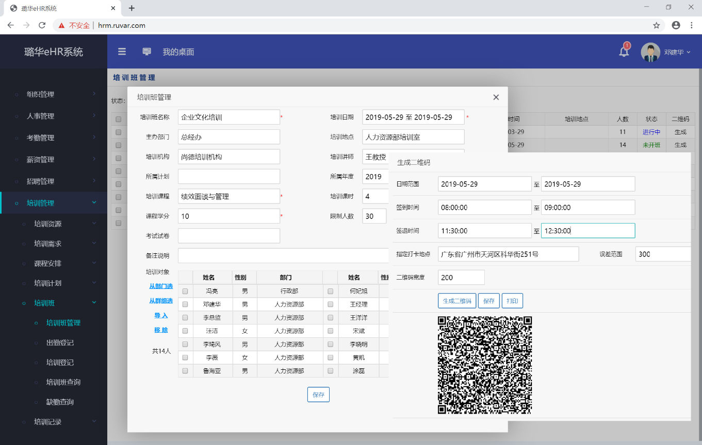 

## 保险福利

- [ ] 保险数据的显示修改

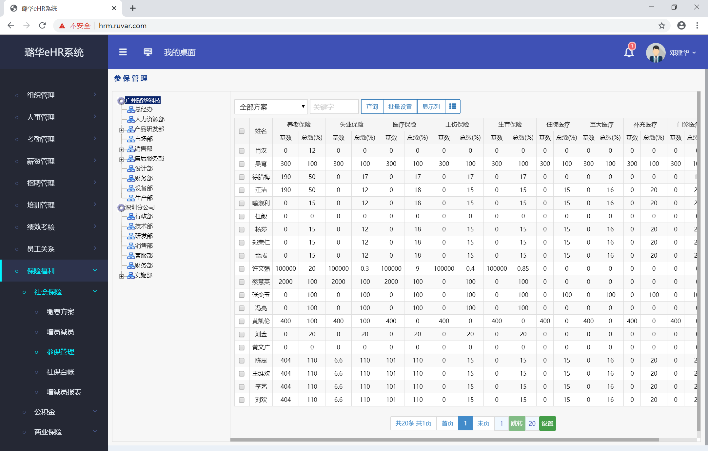 

## 员工关系

- [ ] 多种合同记录的管理
- [ ] 查看所有的合同

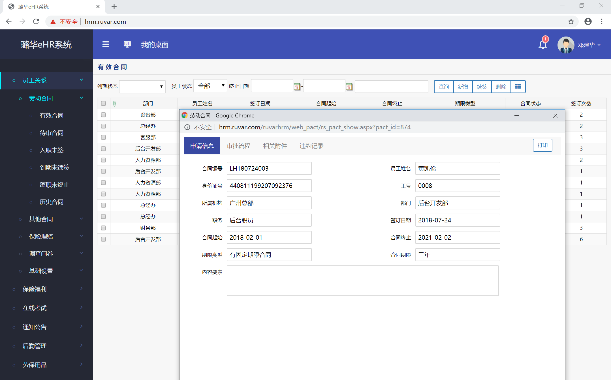 

## 绩效考核

- [ ] 设置不同的绩效考核方案
- [ ] 

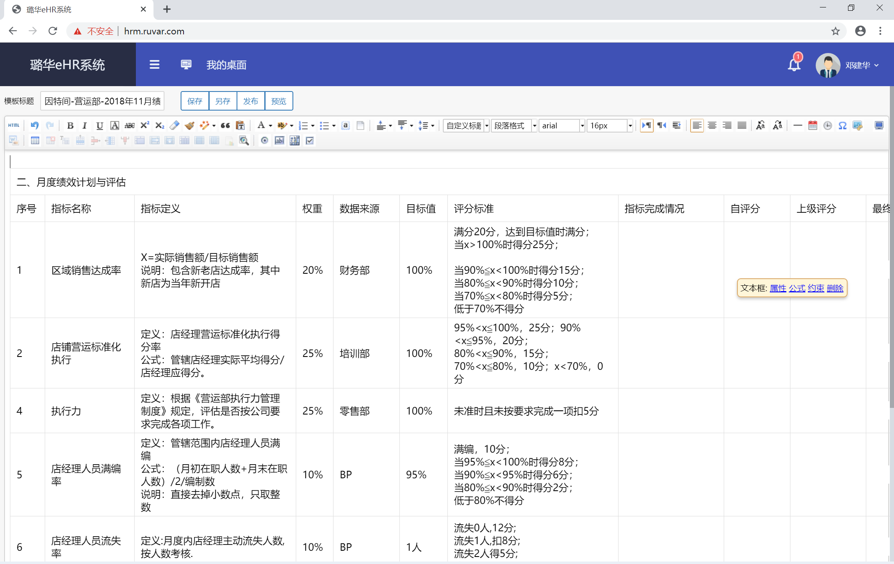  

## 劳保用品

- [ ] 所有劳保用品信息的显示修改
- [ ] 劳保用品的入库出库记录
- [ ] 劳保用品的发放以及归还记录情况
- [ ] 相关图表的信息显示

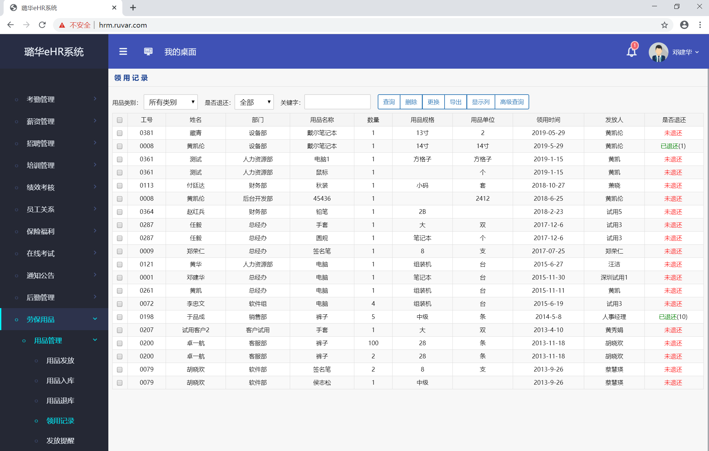 

## 后勤管理

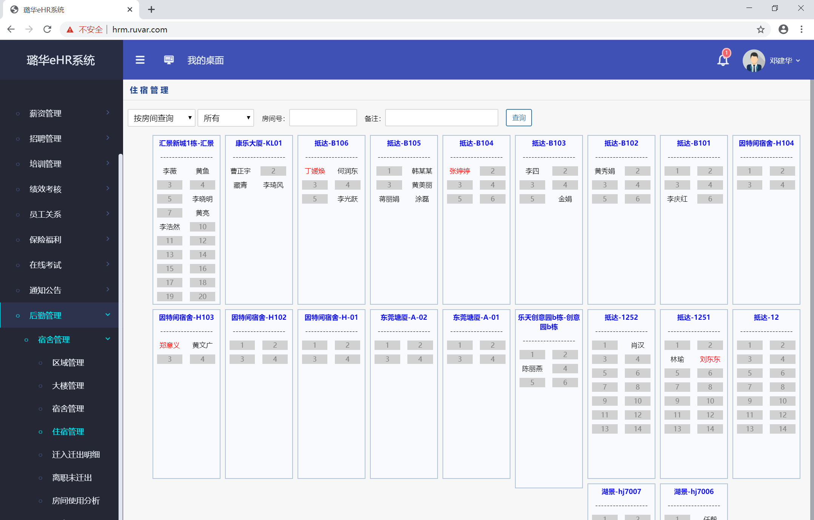 

## 通知公告

- [ ] 根据选择范围发送公告
- [ ] 记录公告阅读情况
- [ ] 查询历史公告信息

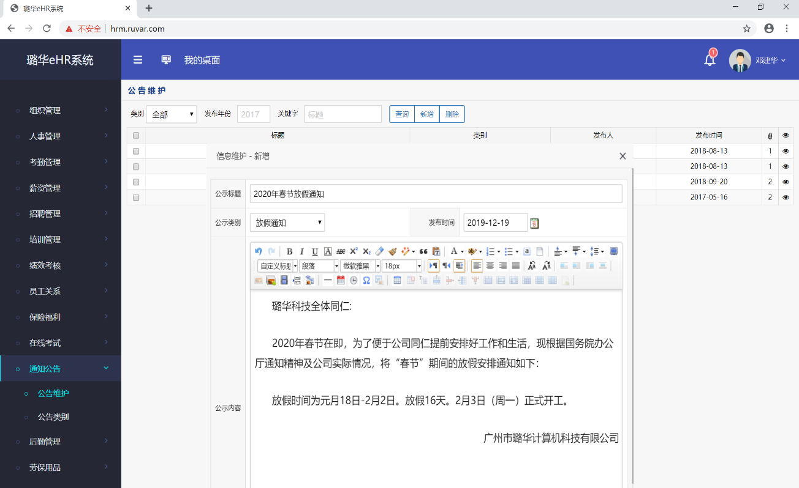 

## 员工自助

- [ ] 查看本人的档案以及考勤、薪资、岗位调动、合同、绩效考核等信息
- [ ] 查看本人排班安排
- [ ] 提交相关事务的申请
- [ ] 查看培训的安排
- [ ] 查看公告信息

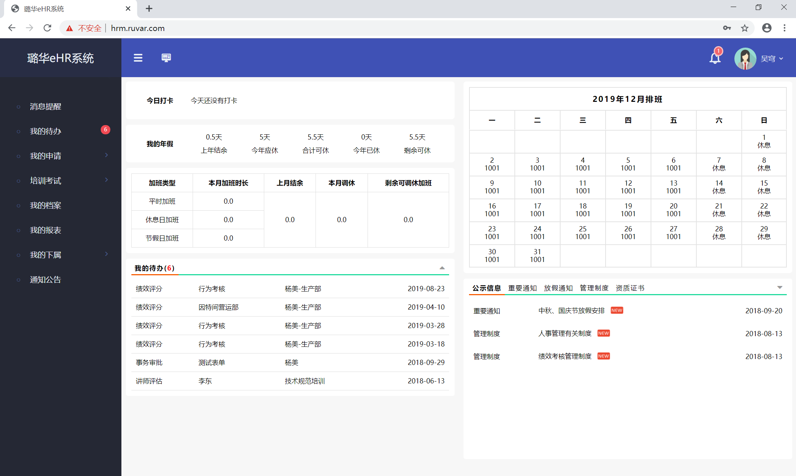 

## 系统管理

- [ ] 用户权限的设置，管理员和普通用户的区别，员工和部门部长的区别
- [ ] 设置账号自动锁定的次数
- [ ] 查询相关操作的日志

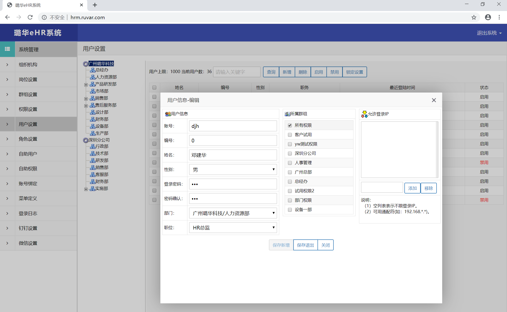 